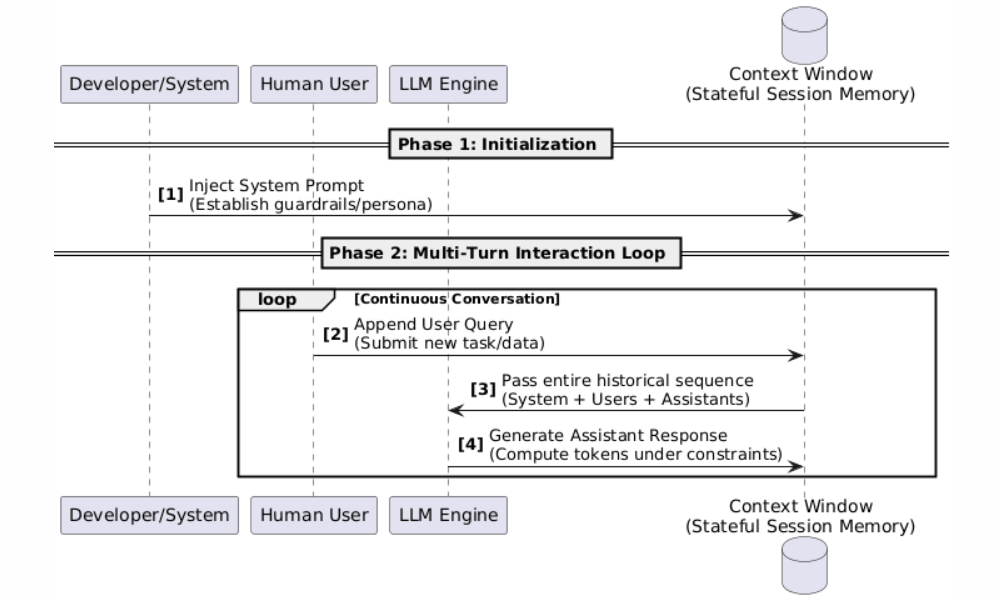

# LLM

A **Large Language Model (LLM)** is an advanced **Artificial Intelligence (AI)** system capable of understanding and processing multimodal content. Today's mainstream LLMs predominantly rely on **decoder-only Transformer architectures**, learning complex patterns from massive public datasets through **self-supervised training**.

At their core, LLMs function through **autoregressive next-token prediction**. By continuously evaluating the probability of the next token and adding it to the sequence, they build up complete responses. This fundamental mechanism drives complex capabilities like logical reasoning, coding, and precise instruction following.

## Token

**Tokens** are the small text units that a LLM reads and generates. When you send a prompt or receive a response, the text is split into chunks called tokens.

Since AI models cannot process raw text directly, they convert text in two steps:
1. **Tokenization**: Common character patterns are grouped into tokens, and each token is assigned a unique ID. Modern LLMs often use methods such as **Byte-Pair Encoding (BPE)**.
2. **Vector Representation**: These token IDs are transformed into mathematical vectors. In this vector space, words with similar meanings are placed close together, helping the model understand context and relationships.

### The "Non-English Penalty"

**English Efficiency**: In English, 1 token is roughly equal to 0.75 words (about 4 characters).

**Higher Token Usage in Other Languages**: Most LLMs are optimized primarily for English, so languages like Chinese, Japanese, or Korean often require more tokens to express the same meaning. For example, a single Chinese character may consume 1–3 tokens.

Because both input and output are measured and billed by token count, non-English languages typically cost more, consume context memory faster, and reduce the amount of text an LLM can process within a single conversation.

## Context Window

The **Context Window** is the maximum number of tokens (including system prompts, chat history, user input, and model output) an LLM can hold in working memory during a single inference cycle.

LLMs are inherently **stateless**, so conversational "memory" is simulated by resending the relevant chat history with every new request. As context length increases, the computational cost of the **Transformer Self-Attention mechanism** grows quadratically at **O(N²)**. Doubling the context length roughly quadruples compute cost, latency, and GPU memory usage.

To reduce this overhead, modern inference systems use **KV Cache (Key-Value Caching)**. It stores previously computed attention states in GPU memory, so only newly added tokens need to be processed. This significantly improves response speed and lowers inference cost.

When a conversation exceeds the model’s maximum context capacity (ranging from 8K to over 2M tokens across different models), older tokens are truncated, and the model loses earlier conversational context.

## Chat Architecture: System, User, and Assistant Roles

Modern LLM APIs structure conversational interactions into three standardized roles to enforce behavioral boundaries, maintain context, and streamline state management. This triad has become the industry baseline for chat interfaces and prompt engineering.

|     Role      | Operational Definition          | Core Engineering Function                                  |
|:-------------:|:--------------------------------|:-----------------------------------------------------------|
|  **System**   | Developer-defined configuration | Sets persona, guardrails, and persistent constraints.      |
|   **User**    | Human end-user input            | Triggers inference turns; provides tasks or data payloads. |
| **Assistant** | LLM-generated output            | Preserves conversational memory and multi-turn coherence.  |

To the end-user, the interface mimics a live, peer-to-peer conversation. In reality, **LLMs are fundamentally stateless mathematical functions with zero native memory.** Every conversational "memory" is an engineering illusion maintained by the dynamic synchronization of the **Context Window**.

The architecture operates as a predictable, multi-turn request-response loop:

**Phase 1: Initialization**

The system prompt is injected once into the context window container to establish the foundational rules, safety guardrails, and domain scope before any user interaction begins.

**Phase 2: Multi-Turn Interaction Loop**

A continuous, recurring lifecycle for ongoing conversation:

- **Interaction**: The user message is appended to the historical sequence inside the context window, signaling the engine to begin a new inference turn.

- **Generation**: The model evaluates the entire accumulated payload (System + past history + new query) to compute the next token sequence under system constraints.

- **Memory State**: The newly generated assistant response is stored back into the context window, transforming it into part of an ever-growing monolithic input for the next loop.

## General LLM Landscape

### Proprietary Models

Exclusively hosted and managed by vendor infrastructure. Developers interact with them strictly via cloud APIs or web platforms. While their internal weights and training data remain confidential, they offer enterprise-grade stability, legal indemnification, and zero-maintenance deployment.

| Developer  | Model                 | Best For                                 |
|:----------:|:----------------------|:-----------------------------------------|
| Anthropic  | Claude Opus 4.7       | Deep research & complex logic.           |
|            | Claude Sonnet 4.6     | Enterprise coding & nuanced writing.     |
|            | Claude Haiku 4.5      | High-speed text parsing.                 |
|   OpenAI   | GPT-5.5               | Elite reasoning & software engineering.  |
|            | GPT-5.4               | Production coding & workflow automation. |
|            | GPT-5.4 mini          | Computer use & subagent execution.       |
|   Google   | Gemini 3.1 Pro        | Deep multimodal & creative analytics.    |
|            | Gemini 3.5 Flash      | Agent orchestration & fast coding.       |
|            | Gemini 3.1 Flash-Lite | Massive context (2M) parsing.            |

### Open-Weight Models

Model weights are publicly released, granting developers the ultimate flexibility to self-host, fine-tune, or run offline. This ecosystem prioritizes absolute data privacy, deep customization, and freedom from vendor lock-in.

|   Developer    | Model             | Best For                               |
|:--------------:|:------------------|:---------------------------------------|
| Alibaba Cloud  | Qwen 3.7-Max      | Autonomous business agents.            |
|                | Qwen 3.6-Plus     | Vibe coding & advanced OCR.            |
|                | Qwen 3.6-Flash    | Fast math & spatial intelligence.      |
|      Meta      | Llama 4 Maverick  | Multimodal reasoning & elite agents.   |
|                | Llama 4 Scout     | Ultra-long context (10M) processing.   |
|    DeepSeek    | DeepSeek-V4-Pro   | Hardcore STEM & codebase architecture. |
|                | DeepSeek-V4-Flash | Dual-mode speed & agent coding.        |

