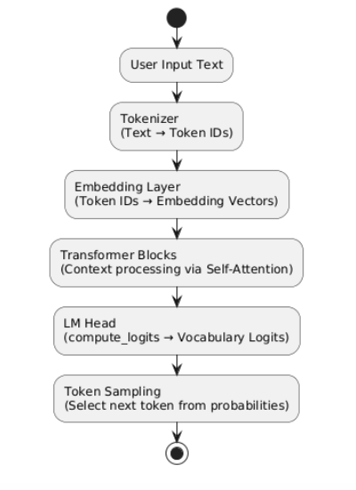
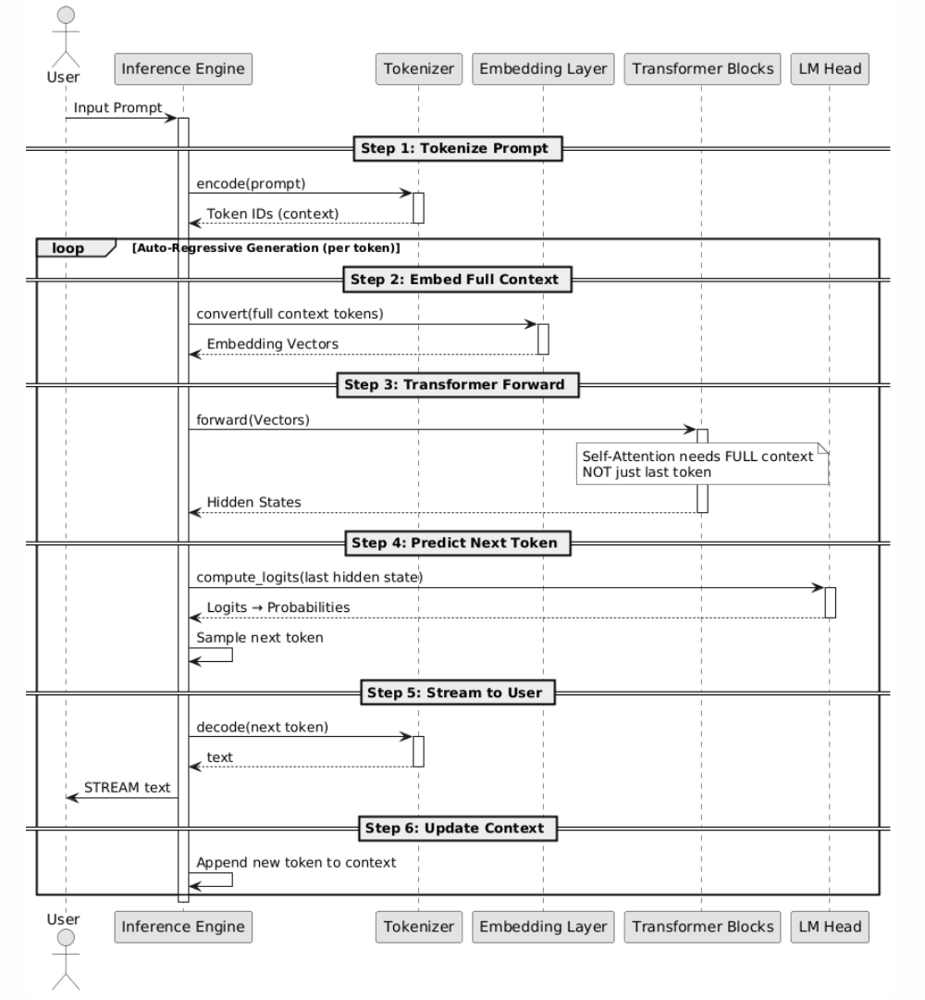

# Inference Engine

In AI systems, **training** and **inference** are two different stages.

- **Training** is the expensive and time-consuming process of teaching a model using massive datasets. During this stage, the model learns patterns and stores them as numerical parameters called **weights**.

- **Inference** is the execution stage. A trained model receives real user input and generates predictions or responses.

However, model weights alone cannot run by themselves. They need runtime software that can load the model, manage memory, execute mathematical operations, and use hardware efficiently. This runtime software is called an **Inference Engine**.

An **Inference Engine** is specialized software that loads a trained model and executes its computations on CPUs or GPUs efficiently.

A typical inference engine handles several core tasks:

- **Memory Management**: loads the model structure into RAM or VRAM and maps the model weights into memory.
- **Hardware Acceleration**: converts neural network operations into optimized instructions for CPUs, GPUs, or other accelerators.
- **Execution Scheduling**: controls how data flows through each neural network layer during inference.
- **Token Generation Loop**: Repeatedly executes the model to generate output token by token.

## Why Is an Inference Engine Needed?

LLMs are autoregressive models. They do not generate a complete answer at once. Instead, they predict text one token at a time in a continuous loop.

A simplified generation pipeline looks like this:



The workflow begins with raw user text. The **tokenizer** converts the text into numerical token IDs, which are then transformed into dense vectors by the **embedding layer**. The **Transformer blocks** process these vectors using self-attention to understand context and relationships between tokens. Finally, the **LM Head** calculates probability scores for the vocabulary and selects the next token.

After generating one token, the model appends that token to the existing context and runs the entire network again to predict the next token. This process repeats until the response is complete.

The following sequence diagram shows how the **inference engine** coordinates the entire generation loop:



Managing this workflow manually is highly complex. It involves tensor allocation, GPU execution, attention caching, token sampling, and repeated model execution. Implementing all of these steps directly in low-level C++ or PyTorch would require a large amount of engineering effort.

The inference engine automates and optimizes this entire process, allowing developers to focus on applications rather than low-level execution details.


## Hugging Face Transformers

**Hugging Face** provides the widely used **Transformers** library, one of the most common frameworks for running LLMs locally.

Although Transformers also supports model training, it is mainly used as a high-level inference runtime in local deployment scenarios.

The library bridges the gap between raw model files (such as `.safetensors`) and actual model execution.

When running an LLM locally, **Transformers** manages the complete inference workflow:
- **Model Initialization**: reads configuration files such as `config.json`, builds the neural network structure, and loads weights from `.safetensors` files.
- **Tokenization Pipeline**: converts input text into token IDs using the `tokenizer` configuration.
- **Model Execution**: sends tensors through the Transformer layers using backends such as **PyTorch**.
- **Attention and KV Cache Management**: stores intermediate attention results to improve generation efficiency.
- **Token Sampling**: processes the output logits and applies strategies such as **Temperature** or **Top-P** sampling to select the next token.

By abstracting these low-level details, **Transformers** allows developers to run powerful LLMs with only a few lines of Python code.

### Install Transformer 

To demonstrate local inference, we can install Transformers on an **Ubuntu 24** VM with 8 vCPUs, 16 GB memory, and 100 GB storage.

```shell
$ sudo apt update && sudo apt upgrade -y
$ touch ~/.hushlogin

$ sudo apt install -y python3 python3-pip python3-venv git build-essential

$ mkdir ~/llm && cd ~/llm
$ python3 -m venv venv
$ source venv/bin/activate

(venv)$ pip3 install --upgrade pip
## SSL fallback: download wheel manually if download fails
## https://download.pytorch.org/whl/torch/torch-2.12.0+cpu-cp312-cp312-manylinux_2_28_x86_64.whl
(venv)$ pip3 install torch --index-url https://download.pytorch.org/whl/cpu
(venv)$ pip3 install transformers accelerate sentencepiece

(venv)$ python3 -c "import torch; print(torch.__version__)" 
2.12.0+cpu
```

In this example, **PyTorch** is installed with CPU-only support, so inference runs entirely on the CPU without GPU acceleration.

### Download Qwen

We can download the open-source Alibaba Cloud **Qwen3.5-0.8B** model locally from the official **Hugging Face** repository: https://huggingface.co/Qwen/Qwen3.5-0.8B/tree/main

The model files can be downloaded using Git or directly from the web interface.

```shell
(venv)$ ls -l ~/llm/Qwen3.5-0.8B
total 1728524
-rw-rw-r-- 1 dadmin dadmin       7755 May 27 05:52 chat_template.jinja
-rw-rw-r-- 1 dadmin dadmin       2907 May 27 05:52 config.json
-rw-rw-r-- 1 dadmin dadmin      11544 May 27 05:52 LICENSE
-rw-rw-r-- 1 dadmin dadmin    3353259 May 27 05:52 merges.txt
-rw-rw-r-- 1 dadmin dadmin 1746942600 May 27 06:02 model.safetensors-00001-of-00001.safetensors
-rw-rw-r-- 1 dadmin dadmin      50900 May 27 05:52 model.safetensors.index.json
-rw-rw-r-- 1 dadmin dadmin        390 May 27 05:52 preprocessor_config.json
-rw-rw-r-- 1 dadmin dadmin      61705 May 27 05:52 README.md
-rw-rw-r-- 1 dadmin dadmin      16709 May 27 05:52 tokenizer_config.json
-rw-rw-r-- 1 dadmin dadmin   12807982 May 27 05:48 tokenizer.json
-rw-rw-r-- 1 dadmin dadmin        385 May 27 05:52 video_preprocessor_config.json
-rw-rw-r-- 1 dadmin dadmin    6722759 May 27 05:52 vocab.json
```
Important files:
- `config.json`: defines the model architecture and hyperparameters.
- `model.safetensors-00001-of-00001.safetensors`: stores the trained model weights in Safetensors format.
- `model.safetensors.index.json`: maps model layers to corresponding weight files.
- `tokenizer.json`: contains the serialized tokenizer used for text encoding and decoding.
- `tokenizer_config.json`: defines tokenizer runtime settings and behavior.
- `vocab.json`: maps text tokens to numerical IDs.
- `merges.txt`: stores BPE merge rules used during tokenization.

### Write a Test Program

The following Python program loads the local Qwen model and performs a simple text generation task.

```python
from transformers import AutoTokenizer, AutoModelForCausalLM
import torch

# ----------------------
# Local model path
# ----------------------
model_path = "./Qwen3.5-0.8B"

print("Loading tokenizer...")
tokenizer = AutoTokenizer.from_pretrained(
    model_path,
    local_files_only=True
)

print("Loading model...")
model = AutoModelForCausalLM.from_pretrained(
    model_path,
    local_files_only=True,
    device_map="cpu",
    torch_dtype="auto"
)

# ----------------------
# Chat prompt
# ----------------------
prompt = "Hello, introduce yourself."
messages = [{"role": "user", "content": prompt}]

# ----------------------
# Apply chat template
# ----------------------
inputs = tokenizer.apply_chat_template(
    messages,
    tokenize=True,
    return_tensors="pt",
    add_generation_prompt=True
)

# Move tensors to target device
inputs = inputs.to(model.device)

# ----------------------
# Generate response
# ----------------------
print("AI response:")

with torch.no_grad():
    outputs = model.generate(
        **inputs,
        max_new_tokens=512,
        pad_token_id=tokenizer.eos_token_id
    )

# ----------------------
# Decode output
# ----------------------
response = tokenizer.decode(outputs[0], skip_special_tokens=True)
print(response)
```

Run the Program

```shell
(venv)$  python3 run_qwen.py
Loading tokenizer...
Loading model...
[transformers] The fast path is not available because one of the required library is not installed. Falling back to torch implementation. To install follow https://github.com/fla-org/flash-linear-attention#installation and https://github.com/Dao-AILab/causal-conv1d
Loading weights: 100%|███████████████████████████████████████████████████████████████████████████████████████████████████████████████| 320/320 [00:00<00:00, 1567.64it/s]
AI response:
user
Hello, introduce yourself.
assistant
<think>

</think>

Hello! I'm Qwen3.5, a large language model developed by Tongyi Lab. I'm designed to assist you with a wide range of tasks, from creative writing and logical reasoning to code generation and data analysis. How can I help you today?
```