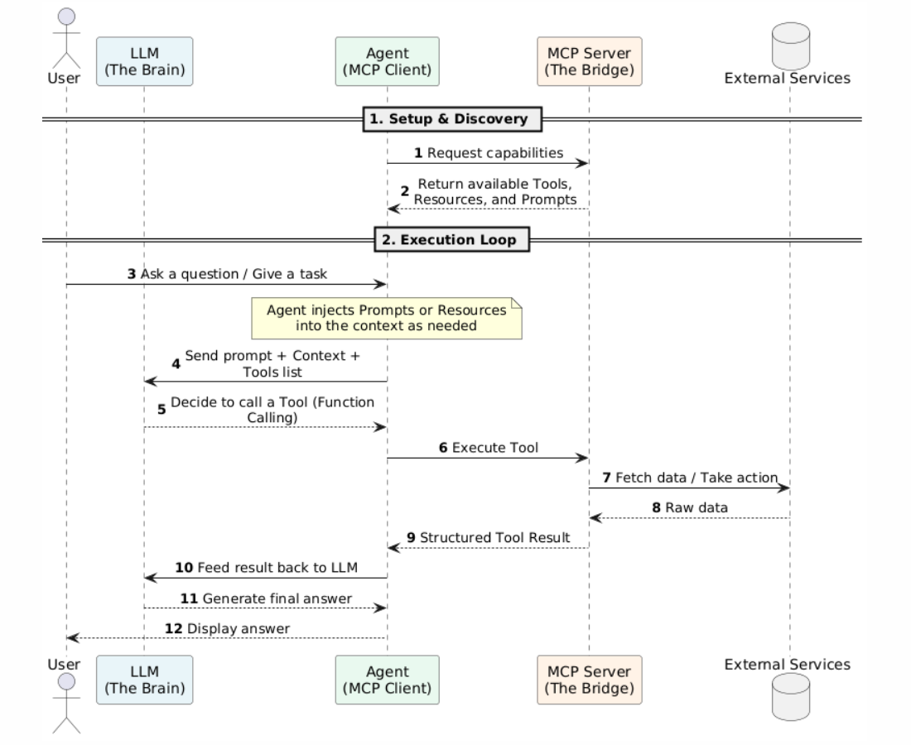

# MCP

The **Model Context Protocol (MCP)** is an open standard that enables AI applications to securely access external data and execute actions through a unified interface.

Instead of building custom integrations for every AI tool, developers can expose data and functionality through MCP servers. Any MCP-compatible client can then use these capabilities without additional integration work.

## Core Concepts

MCP defines three core building blocks that allow AI applications to interact with external systems.

**1. Tools (Executable Actions)**

Tools allow an AI application to perform actions in external systems. A tool may execute code, call an API, query a service, or update a database.

Tools extend AI applications beyond text generation and enable interaction with real-world systems.

**2. Resources (Read-Only Data)**

Resources provide external information for the model to read without modifying anything.

Examples include:
- Documents
- Log files
- Configuration files
- Database records

Resources supply the factual context that helps the model generate accurate responses.

**3. Prompts (Reusable Instructions)**

Prompts are reusable templates that guide model behavior.

Instead of repeatedly writing the same instructions, developers can define standardized prompts on the MCP server. This helps ensure consistent behavior across different applications and use cases.

## Workflow

MCP follows a client-server architecture. The AI application acts as an MCP client, while external data sources and business services are exposed through MCP servers.

### MCP Server

An MCP server exposes tools, resources, and prompts to clients.

Conceptually, it is similar to an API service designed specifically for AI applications. A single server may expose dozens or even hundreds of capabilities related to a particular domain.

### MCP Client

An MCP client connects to one or more MCP servers.

The client discovers available capabilities from MCP servers and makes them accessible to the LLM. This allows AI applications to gain new capabilities without modifying the underlying model.

### MCP and AI Agents

MCP has become an essential building block for modern AI agents. To function independently, an autonomous agent fundamentally relies on two core pillars:

- **Context**: access to real-time data, knowledge, and facts.
- **Agency**: the ability to execute tools and take meaningful actions in the real world.

By providing a standardized, universal interface to connect with any external system, MCP eliminates custom integration code and single-handedly delivers both capabilities.

Here is how a typical AI Agent workflow interacts through MCP:




## A Simple MCP Example

Install the MCP Python SDK:

```shell
$ pip install "mcp[cli]"
```

### The MCP Server

The server exposes a Python function as an MCP tool, allowing AI clients to discover and invoke it through the MCP protocol.

```python
from mcp.server.fastmcp import FastMCP

# Initialize MCP server instance
mcp = FastMCP(
    "weather-service",
    host="127.0.0.1",
    port=8000,
    json_response=True,
    stateless_http=True
)

# Define exposed weather tool
@mcp.tool()
def get_weather(city: str) -> str:
    weather_data = {
        "beijing": "sunny, 25°C",
        "shanghai": "rainy, 22°C",
        "guangzhou": "cloudy, 28°C"
    }
    return weather_data.get(city.lower(), "Weather not found")

if __name__ == "__main__":
    # Start with official Streamable HTTP transport
    mcp.run(transport="streamable-http")
```

Start the server:

```shell
$ python3 mcp_server.py
INFO:     Started server process [38540]
INFO:     Waiting for application startup.
[06/03/26 03:30:45] INFO     StreamableHTTP       streamable_http_manager.py:131
                             session manager
                             started
INFO:     Application startup complete.
INFO:     Uvicorn running on http://127.0.0.1:8000 (Press CTRL+C to quit)

## Client connects and discovers available tools: 
INFO:     127.0.0.1:48088 - "POST /mcp HTTP/1.1" 200 OK
[06/03/26 03:32:34] INFO     Terminating session: None    streamable_http.py:785
INFO:     127.0.0.1:48088 - "POST /mcp HTTP/1.1" 202 Accepted
                    INFO     Terminating session: None    streamable_http.py:785
                    INFO     Processing request of type            server.py:727
                             ListToolsRequest
INFO:     127.0.0.1:48098 - "POST /mcp HTTP/1.1" 200 OK
                    INFO     Terminating session: None    streamable_http.py:785
                    
## Client invokes the 'get_weather' tool:
[06/03/26 03:33:14] INFO     Processing request of type            server.py:727
                             CallToolRequest
INFO:     127.0.0.1:39370 - "POST /mcp HTTP/1.1" 200 OK
                    INFO     Terminating session: None    streamable_http.py:785
```

### The Agent Client

The client manages the LLM and communicates with the MCP server.

```python
import torch
import re
import asyncio
from transformers import AutoTokenizer, AutoModelForCausalLM
from mcp.client.streamable_http import streamable_http_client
from mcp.client.session import ClientSession

# ----------------------
# 1. Model Loading
# ----------------------
model_path = "./Qwen3.5-0.8B"
print("Loading model...")

tokenizer = AutoTokenizer.from_pretrained(model_path, local_files_only=True)
model = AutoModelForCausalLM.from_pretrained(
    model_path,
    local_files_only=True,
    device_map="cpu",
    torch_dtype="auto"
)

# ----------------------
# 2. Agent Loop (Persistent MCP HTTP Connection)
# ----------------------
async def agent_loop():
    # Maintain one persistent MCP connection throughout the loop
    async with streamable_http_client("http://127.0.0.1:8000/mcp") as (read, write, _):
        async with ClientSession(read, write) as session:
            await session.initialize()

            # Fetch tool list dynamically from MCP server
            tools_res = await session.list_tools()
            tools = [{"type": "function", "function": t.model_dump()} for t in tools_res.tools]
            print("Successfully loaded tools from MCP:", [t["function"]["name"] for t in tools])

            # Initialize conversation
            messages = [
                {"role": "system", "content": "You are a helpful AI Agent."},
                {"role": "user", "content": "What is the weather today in Beijing?"}
            ]

            max_steps = 5
            for step in range(max_steps):
                print(f"\n=== Agent Step {step + 1} ===")

                # Build LLM input with tools
                inputs = tokenizer.apply_chat_template(
                    messages,
                    tools=tools,
                    return_tensors="pt",
                    add_generation_prompt=True
                ).to(model.device)

                # Generate response
                with torch.no_grad():
                    outputs = model.generate(
                        **inputs,
                        max_new_tokens=256,
                        do_sample=False,
                        pad_token_id=tokenizer.eos_token_id
                    )

                # Extract only newly generated tokens
                new_tokens = outputs[0][inputs["input_ids"].shape[1]:]
                response_text = tokenizer.decode(new_tokens, skip_special_tokens=True)
                print("Raw LLM Output:\n", response_text)

                # Handle function calling
                if "<tool_call>" in response_text:
                    print("\n[Function Calling Triggered]")

                    # Parse function name
                    func_match = re.search(r"<function=(.*?)>", response_text)
                    if not func_match:
                        break

                    func_name = func_match.group(1).strip()
                    param_matches = re.findall(r"<parameter=(.*?)>\s*(.*?)\s*</parameter>", response_text, re.DOTALL)
                    arguments = {k.strip(): v.strip() for k, v in param_matches}

                    print(f"Function: {func_name}")
                    print(f"Params: {arguments}")

                    # Execute tool via MCP HTTP connection
                    res = await session.call_tool(name=func_name, arguments=arguments)
                    result = res.content[0].text if res.content else "No result"
                    print(f"Tool Result: {result}")

                    # Update conversation history
                    messages.append({"role": "assistant", "content": response_text})
                    messages.append({"role": "tool", "name": func_name, "content": result})
                    continue

                else:
                    # Final answer from LLM
                    print("\n[Final Answer]:\n", response_text)
                    break

if __name__ == "__main__":
    asyncio.run(agent_loop())
```

```shell
$ python3 mcp_client.py
Loading model...
[transformers] The fast path is not available because one of the required library is not installed. Falling back to torch implementation. To install follow https://github.com/fla-org/flash-linear-attention#installation and https://github.com/Dao-AILab/causal-conv1d
Loading weights: 100%|██████████████████████| 320/320 [00:00<00:00, 1513.77it/s]
Successfully loaded tools from MCP: ['get_weather']

=== Agent Step 1 ===
Raw LLM Output:
 <tool_call>
<function=get_weather>
<parameter=city>
Beijing
</parameter>
</function>
</tool_call>


[Function Calling Triggered]
Function: get_weather
Params: {'city': 'Beijing'}
Tool Result: sunny, 25°C

=== Agent Step 2 ===
Raw LLM Output:
 The weather today in Beijing is sunny, with a temperature of 25°C.


[Final Answer]:
 The weather today in Beijing is sunny, with a temperature of 25°C.
```