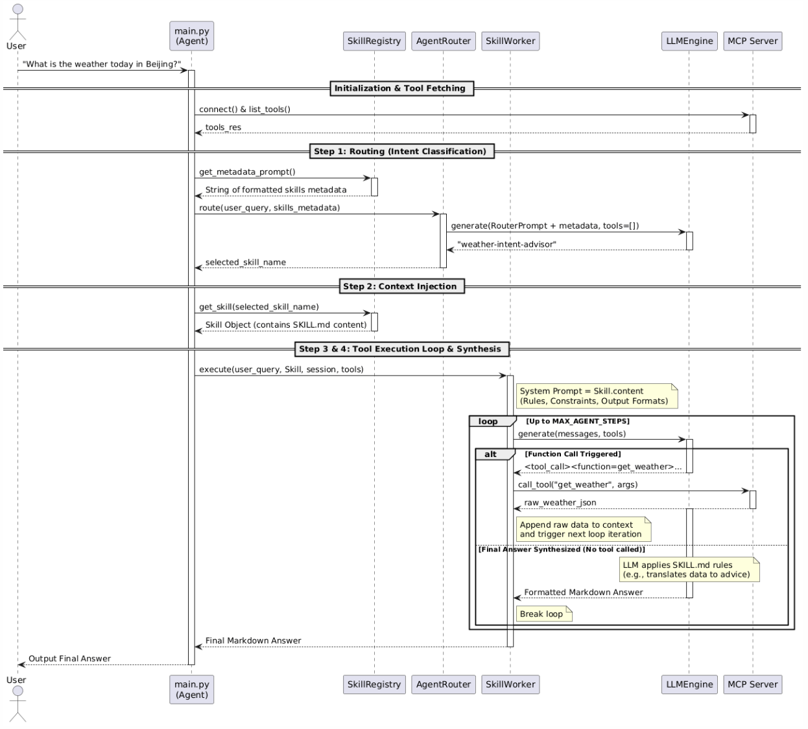

# Skill

**Agent Skills** were introduced by **Anthropic** in October 2025. The concept was later adopted as an open industry standard in December 2025.

A skill is a reusable capability that allows an AI agent to perform a specific task. Skills enable agents to interact with external systems, process data, and execute actions beyond simple text generation. By organizing capabilities into independent skills, developers can extend an agent's functionality without retraining the underlying model.

## Progressive Disclosure

**Progressive Disclosure** is a core context management mechanism built into Anthropic's Agent Skills. Rather than loading the full instructions for every skill into the context window upfront, the system delivers information to the AI strictly on a need-to-know basis.

It operates across three dynamic layers:

1. **Metadata Level**: On initialization, the agent only loads a lightweight index containing each skill’s name and a brief summary. No detailed instructions are exposed at this stage.

2. **Instruction Level**: Once the agent identifies and selects a target skill, it dynamically loads the complete execution instructions defined in the corresponding `SKILL.md` file.

3. **Resource Level**: For complex executions, additional supporting assets (such as reference documents, code snippets, or auxiliary scripts) are fetched only when dictated by specific operational steps.

This design effectively prevents context window bloat and significantly reduces token consumption. By filtering out irrelevant contextual noise, it keeps the agent laser-focused on the current task and drastically mitigates model hallucinations.

## Anatomy of a Skill

A standard agent skill consists of specific components that allow the AI to choose, understand, and execute it autonomously.

- **Identifier**: A unique name for the system to invoke the skill. This is a mandatory field defined in the frontmatter of `SKILL.md`.
- **Description**: A clear overview of the skill’s functionality. The AI references this content to determine applicable scenarios. It is also a required field in the file header.
- **Input Schema**: Formal rules (usually defined via JSON Schema) that specify required fields, data types and constraints for valid inputs. This part can be documented freely in the skill file or implemented in underlying code.
- **Execution Logic**: Code, scripts or API endpoints that carry out the core task. It exists as backend implementation rather than fixed content in `SKILL.md`.
- **Output Format**: Standardized structured results returned to the AI for follow-up processing. Its definition can be added optionally within the skill documentation.

### Reference 

- Official repo with skill standards, templates and samples: https://github.com/anthropics/skills
- Community collection of practical skills: https://github.com/ComposioHQ/awesome-claude-skills
- Centralized platform for skill discovery and deployment: https://www.skillhub.club/

## Router and Worker Pattern

This architecture separates decision-making from task execution to handle complex workflows efficiently.

- **Router Agent (Orchestrator)**: Manages intent classification and task routing. It coordinates work across workers without executing skills directly.
- **Worker Agents (Specialists)**: Task-specific sub-agents with custom prompts and limited access to dedicated skills.

Execution Flow:

- User sends a request.
- Router distributes subtasks to workers.
- Workers run assigned skills and return results.
- Router aggregates outputs or schedules subsequent tasks.

## Implement router-worker pattern

The updated project layout introduces a separation of concerns between **intent routing** (`router.py`), **skill registration** (`skill_registry.py`), and **task execution** (`worker.py`).

```shell
$ tree agent-lite/
agent-lite/
├── config.py                       # Stores global settings like model paths and server network configurations.
├── core
│   ├── llm_engine.py               # Loads the local language model and manages text generation inference.
│   ├── mcp_client.py               # Connects to the MCP server to dynamically list and call available tools.
│   ├── parser.py                   # Extracts tool calls, function names, and parameters from raw LLM output.
│   ├── router.py                   # (NEW) Identifies user intent and routes subtasks to specific worker agents.
│   ├── skill_registry.py           # (NEW) Scans and registers available skills from the skills directory for metadata loading.
│   └── worker.py                   # (NEW) Executes the task-specific agent loop to handle reasoning and tool execution.
├── main.py                         # Acts as the main entry point to initialize and run the agent framework.
├── mcp_server.py                   # Runs the FastMCP server to define and expose executable tools to the client.
└── skills
    └── weather-intent-advisor
        └── SKILL.md                # (NEW) Contains the detailed instruction manual and rules for the weather advisor skill.
```

The sequence diagram below details the system lifecycle.:



Executing `main.py` validates the two-stage lifecycle in runtime.

```shell
$ python3 agent-lite/main.py
=== Initializing Agent-Lite (Skill-Driven) ===
Loading model...
[ERROR] `loss` is part of Qwen3_5CausalLMOutputWithPast.__init__'s signature, but not documented. Make sure to add it to the docstring of the function in C:\Users\liuyijun\CLionProjects\ai\.venv\Lib\site-packages\transformers\models\qwen3_5\modeling_qwen3_5.py.
[ERROR] `logits` is part of Qwen3_5CausalLMOutputWithPast.__init__'s signature, but not documented. Make sure to add it to the docstring of the function in C:\Users\liuyijun\CLionProjects\ai\.venv\Lib\site-packages\transformers\models\qwen3_5\modeling_qwen3_5.py.
[transformers] The fast path is not available because one of the required library is not installed. Falling back to torch implementation. To install follow https://github.com/fla-org/flash-linear-attention#installation and https://github.com/Dao-AILab/causal-conv1d
Loading weights: 100%|██████████| 320/320 [00:00<00:00, 2374.11it/s]
Successfully loaded skill: weather-intent-advisor

[User Query]: What is the weather today in Beijing?
Successfully loaded 1 tools from MCP Server.

--- STAGE 1: ROUTING ---
Router Decision: Assigned to 'weather-intent-advisor'

--- STAGE 2: EXECUTION ---

=== Worker Step 1 ===
Raw LLM Output:
 <tool_call>
<function=get_weather>
<parameter=city>
Beijing
</parameter>
</function>
</tool_call>


[Function Calling Triggered]
Function: get_weather | Params: {'city': 'Beijing'}
Tool Result: sunny, 25°C

=== Worker Step 2 ===
Raw LLM Output:
 ### 🌤️ Weather Context: Beijing (Today)
**The Numbers:** Sunny, 25°C

### 💡 What this means for you:
- **👕 Clothing:** Layered clothing is recommended due to the sunny conditions.
- **🚶‍♂️ Activity/Travel:** No specific impact on transit or outdoor plans.
- **⚠️ Alerts:** No alerts for UV, Air Quality, or Storms.


[Final Synthesis Reached]

==========================================
[FINAL ANSWER DELIVERED TO USER]
==========================================
### 🌤️ Weather Context: Beijing (Today)
**The Numbers:** Sunny, 25°C

### 💡 What this means for you:
- **👕 Clothing:** Layered clothing is recommended due to the sunny conditions.
- **🚶‍♂️ Activity/Travel:** No specific impact on transit or outdoor plans.
- **⚠️ Alerts:** No alerts for UV, Air Quality, or Storms.
```