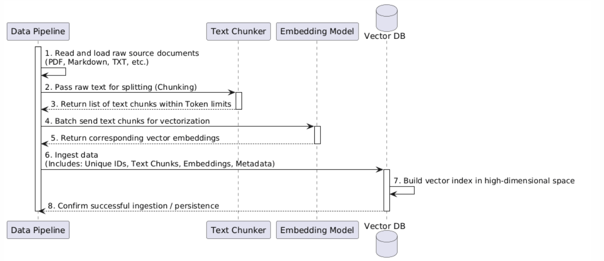
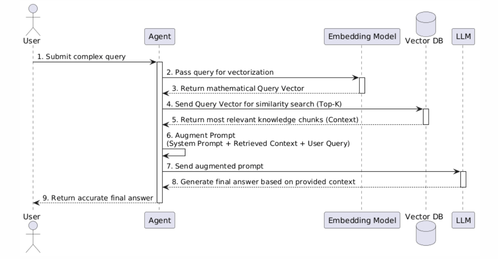

# RAG

LLMs are incredibly smart, but they have two major limitations:

- **Their knowledge is frozen in time** (they do not know recent news).
- **They cannot access private data.** When asked about unfamiliar topics, an LLM might guess and provide false information (a phenomenon known as a "hallucination").

**RAG (Retrieval-Augmented Generation)** solves this problem. It acts like an open-book exam for the AI. Instead of relying solely on its internal memory, RAG allows the AI to search a reliable knowledge base first, read the actual facts, and then generate an accurate answer based strictly on what it found.

## How RAG Works in an Agent Workflow

In an AI Agent workflow, RAG acts as the "research and memory" module. When an Agent is assigned a task that requires specific knowledge, it triggers the RAG process.

The workflow happens in three steps:

- **Retrieve**: The user asks a question. The Agent searches the external database to find the most relevant paragraphs or documents.

- **Augment**: The Agent takes the user's original question and combines it with the retrieved documents to create a rich, informative prompt.

- **Generate**: The Agent sends this newly combined prompt to the LLM. The LLM reads the provided context and generates a precise final answer.

## Vector Database

A **vector database** stores data as **vectors (embeddings)** rather than plain text.

An **embedding** is a numerical representation of text generated by an **embedding model**, which acts as a semantic translator. It reads a piece of text (like a sentence or a document chunk) and translates its core meaning into a high-dimensional vector. 

Example:
```
"Linux container" -> [0.12, -0.45, 0.87, ...]
"Docker runtime"  -> [0.15, -0.42, 0.81, ...]
```

Because they are mapped by meaning, texts with similar meanings produce vectors that are close to each other in the vector space. This enables **semantic search** instead of traditional, rigid keyword matching.

### Add data to Vector Database (Data Ingestion)

Before documents can be searched, they must be processed and indexed by a data pipeline. This ingestion workflow happens in the following stages:

- **Load and Chunk**: A Data Pipeline reads raw source documents (like PDFs or Markdown files) and passes them to a Text Chunker, which splits the long text into smaller, token-limited chunks.

- **Generate Embeddings**: The pipeline sends these text chunks in batches to an Embedding Model, which extracts their features and converts them into multi-dimensional arrays (vectors).

- **Ingest and Index**: The pipeline saves the text chunks, their newly generated vectors, unique IDs, and metadata into the Vector Database. The database then builds a high-dimensional index to allow for fast similarity searching later.



### Fetch data from Vector Database

When a user submits a query, the AI Agent acts as an orchestrator, coordinating between the embedding model, the vector database, and the LLM to generate a factual response:

- **Vectorize the Query**: The user asks a question. The Agent passes this text to the Embedding Model, which translates it into a mathematical Query Vector.

- **Similarity Search**: The Agent sends this Query Vector to the Vector Database. The database calculates the mathematical distances and returns the Top-K most relevant knowledge chunks (the Context).

- **Augment and Generate**: The Agent combines the user's original query, the retrieved Context, and system instructions into a single, rich prompt. This augmented prompt is sent to the LLM, which reads the context and generates an accurate final answer for the user.




## Chroma

**Chroma** is a lightweight, open-source vector database designed specifically for AI applications. It is highly developer-friendly and runs easily on local machines.

The following code snippet from [rag_mcp_server.py](../agent-lite/rag_mcp_svc/rag_mcp_server.py) demonstrates how to perform core RAG operations using Chroma in Python:

```python
import chromadb

# 1. Initialize a locally persisted Chroma client
chroma_client = chromadb.PersistentClient(path="VECTOR_DB_DIR")

# 2. Get or create a target collection (like a table)
collection = chroma_client.get_or_create_collection(name="agent_knowledge")

# 3. Insert text chunks with their embeddings and unique IDs
collection.add(
    documents=chunks,
    embeddings=get_embeddings(chunks),
    ids=[f"id_{i}" for i in range(len(chunks))]
)

# 4. Retrieve Top-K similar results based on the query's embedding
results = collection.query(
    query_embeddings=get_embeddings([formatted_query]),
    n_results=TOP_K
)

# 5. Delete the collection when it is no longer needed
chroma_client.delete_collection(name="agent_knowledge")
```

I encapsulated the RAG functionality into an independent MCP server.

Here is the directory structure:

```
agent-lite/
├── rag_mcp_svc
│   ├── config.py
│   ├── kb_data
│   │   └── G450_43_30_00_readme.txt
│   ├── rag_mcp_client.py
│   └── rag_mcp_server.py
```

Then ran an interactive test using the client script.

```shell
$ python3 agent-lite/rag_mcp_svc/rag_mcp_client.py
Loading LLM model...
[ERROR] `loss` is part of Qwen3_5CausalLMOutputWithPast.__init__'s signature, but not documented. Make sure to add it to the docstring of the function in C:\Users\liuyijun\CLionProjects\ai\.venv\Lib\site-packages\transformers\models\qwen3_5\modeling_qwen3_5.py.
[ERROR] `logits` is part of Qwen3_5CausalLMOutputWithPast.__init__'s signature, but not documented. Make sure to add it to the docstring of the function in C:\Users\liuyijun\CLionProjects\ai\.venv\Lib\site-packages\transformers\models\qwen3_5\modeling_qwen3_5.py.
[transformers] The fast path is not available because one of the required library is not installed. Falling back to torch implementation. To install follow https://github.com/fla-org/flash-linear-attention#installation and https://github.com/Dao-AILab/causal-conv1d
Loading weights: 100%|██████████| 320/320 [00:00<00:00, 7940.42it/s]
=== RAG-MCP Interactive Client ===
MCP Server: http://127.0.0.1:8889/mcp
Input your question, type exit to quit

Loaded MCP Tools: ['retrieve_knowledge']

Your Question: give some pre install instructions for Gateways prior to 7.1

LLM Tool Call Instruction:
<tool_call>
<function=retrieve_knowledge>
<parameter=query>
Gateways pre-installation instructions prior to version 7.1
</parameter>
</function>
</tool_call>


Calling MCP RAG Tool: retrieve_knowledge
Search Params: {'query': 'Gateways pre-installation instructions prior to version 7.1'}

RAG Retrieved Context:
++++++++++++
2) Pre Install Instructions
++++++++++++++++++++++++++++
IMPORTANT! Gateways running a release prior to Release 7.1.2 Build 39.5.0 MUST first install Release 7.1.0.5 (

Final Answer:
Based on the context retrieved, here are the pre-install instructions for Gateways prior to Release 7.1.2 Build 39.5.0:

1.  **Install the Base Version:** You must first install the base version of the Gateway, which is **Release 7.1.0.5**.
2.  **Verify Compatibility:** Ensure that the Gateway you are deploying is compatible with the installed base version.
3.  **Proceed to Deployment:** Once the base version is installed and verified, you can proceed with the deployment of the Gateway.

Please note that if you are deploying a Gateway running a release prior to **Release 7.1.2 Build 39.5.0**, you must first install the base version of the Gateway, which is **Release 7.1.0.5**.
```