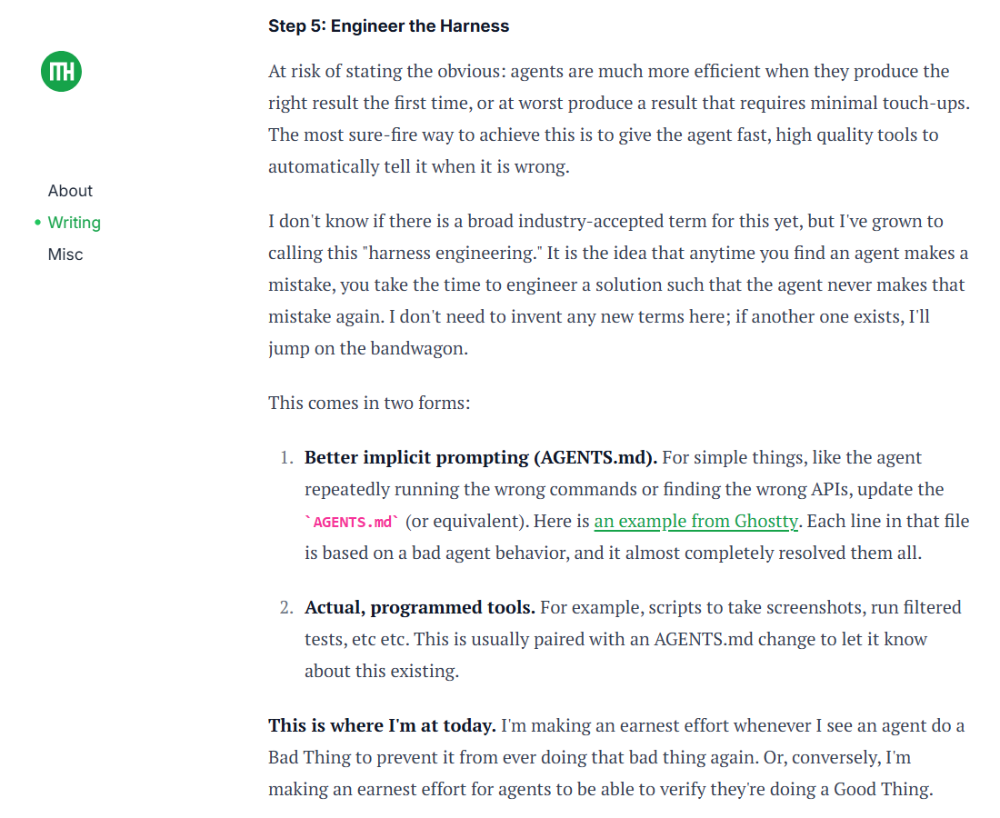
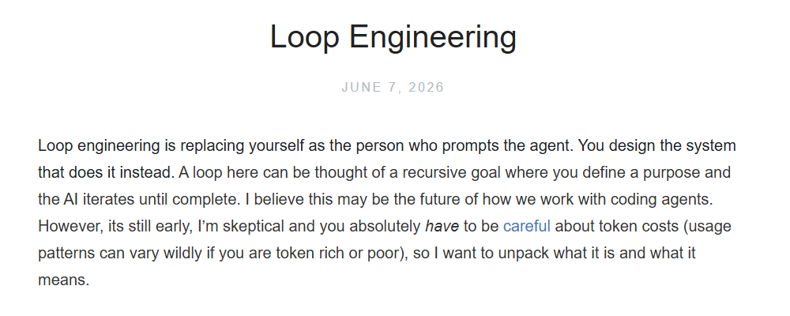

# Agent Engineering

**Agent Engineering** is the discipline of designing systems that enable AI models to act on their own and work reliably in the real world. Over the past years, the field has grown through four different stages. Each stage fixes a major problem of the one before it.

## Prompt Engineering (2022-2023)

After **OpenAI** released GPT-3.5 in November 2022, **Prompt Engineering** became the first basic way to control how AI acts.

Early LLMs gave messy, random, or low-quality answers when users asked vague or unorganized questions. People noticed that even small changes to how you phrased a request could completely change the result. So they started studying exactly how to write instructions to get the AI to think and respond correctly.

Key techniques include:
- **Role prompting**: Assign the AI a specific job or persona
- **Few-shot learning**: Show the AI clear examples of what you want
- **Chain-of-Thought reasoning**: Ask the AI to explain its steps out loud
- **Output formatting**: Tell the AI to use a fixed, easy-to-read structure

This works really well for one-off questions or tasks. But it has big limits. All the guidance has to fit into a single text prompt. For long, multi-step jobs that need the AI to remember things or use outside information, prompt engineering quickly stops working well.

## Context Engineering (2024-2025)

As AI started being used widely in businesses in 2024 and 2025, **Context Engineering** became the next big approach. It was led by Anthropic and Andrej Karpathy, and became a formal field in 2025.

Even with the best prompts, AI models were still stuck with the knowledge they had from training. They couldn't remember past conversations well, didn't know new information, and couldn't access a company's private data. This made them make up facts (hallucinations) or give wrong, outdated answers.

**Context Engineering** changed everything. Instead of only telling the AI what to do, people started controlling what information the AI could see. **Andrej Karpathy** put it best: "Context engineering is the delicate art and science of filling the context window with just the right information for the next step."

Think of context as the AI's short-term memory. The goal is to give it exactly the information it needs, right when it needs it. Key techniques include:
- **Retrieval-Augmented Generation (RAG)**: Pull information from external databases
- **Dynamic context loading**: Only load information when the AI needs it
- **Hierarchical memory**: Separate short-term, long-term, and past conversation memory
- **Context filtering**: Remove unimportant information to save space

Bad context management creates "context debt", mistakes that pile up because the AI is missing, using old, or getting conflicting information. These mistakes can't be fixed by writing better prompts. This is why developers moved on to the next generation of agent engineering practices.

## Harness Engineering (February 2026)

**Mitchell Hashimoto**, co-founder of HashiCorp and creator of Terraform, introduced **Harness Engineering** in February 2026. It quickly became the standard for building production-ready AI agents. 

Refer to https://mitchellh.com/writing/my-ai-adoption-journey

Before **Harness Engineering**, developers relied only on prompts. But even with perfect prompts, AI agents frequently made mistakes, forgot rules, or went into endless loops.

Hashimoto's core formula is: **Agent = Model + Harness**. The AI model provides the raw thinking power, but the harness is the rigid software engineering system built around it to keep it safe, predictable, and reliable.

The golden rule is simple: **When an agent makes a mistake, do not rewrite the prompt. Instead, change the environment to make that mistake physically or programmatically impossible to repeat.**

To make AI loops safe and autonomous, a standard harness is built across six practical layers:
1. **Context Refinement (Filter)**: It strips away useless data and feeds the AI only the exact code, files, or rules (like an `AGENTS.md file`) needed for the current step, saving token costs and keeping the AI focused.
2. **Tool System (Interface)**: It defines strict, typed boundaries (such as the **MCP**) for how the AI interacts with databases, file systems, or networks, preventing the AI from making up broken API inputs.
3. **Execution Orchestration (Controller)**: It enforces the working steps (Plan >> Build >> Test) and tracks the agent's loop. Crucially, it includes a Circuit Breaker; if the AI fails and retries a task 5 times, this layer kills the process to prevent massive token bills.
4. **Memory & State (Notebook)**: It tracks short-term thoughts (scratchpad) and long-term history (vector databases). It ensures the AI remembers the original goal even after 50 rounds of automated troubleshooting.
5. **Evaluation & Observability (Judge)**: It monitors performance, token spend, and errors. It uses independent Evaluator Agents to score and test the AI’s output before allowing the work to move forward.
6. **Constraint & Recovery (Safety Net)**:
   - **Constraints** lock the AI inside an isolated Sandbox (like Docker) so it cannot run dangerous system commands.
   - **Recovery** catches errors (like failing a code linter or test) and automatically rewrites them into simple, clear instructions so the AI knows exactly how to self-correct in the next loop.

**Harness Engineering** changes the job of human developers. In the past, engineers wrote code. In the AI era, because agents write the code, human engineers design constraint systems. By building right pipes and gates around the AI, we turn unpredictable chatbots into safe, autonomous digital workers.

## Loop Engineering (June 2026)

**Addy Osmani**, Google Chrome Engineering Lead, introduced **Loop Engineering** in June 2026. It builds on earlier work by **Boris Cherny** at Anthropic (creator of Claude Code) and **Peter Steinberger**.

Refer to https://addyosmani.com/blog/loop-engineering/

Even with good harnesses, agents still couldn't finish long, complex tasks on their own. They needed humans to constantly tell them what to do next. For a big project, you might have to give hundreds of prompts and check every step.

**Loop Engineering** is the biggest change yet. Instead of humans prompting agents, now systems prompt agents. As **Boris Cherny** said: "I don't prompt Claude anymore. I have loops that are running. They're the ones that are prompting Claude and figuring out what to do."

The main idea is that complex tasks can't be done in one go. Instead, agents work in repeating cycles: **Do something → See what happened → Decide what to do next → Repeat**. This continues until the goal is reached or something goes wrong.

There are three important types of loops:
- **Inner Loop**: The model's own thinking process. This is where it decides what action to take next.
- **Outer Loop**: The system that actually runs the action, gets feedback from the world, and updates what the agent knows.
- **Verification Loop**: A separate "checker" agent that looks at the work of the "maker" agent. It only approves work if it's correct and meets the requirements.

Key parts of a well-built loop system include:
- Clear, measurable goals and rules for when to stop Permanent state storage that keeps working even if the model restarts
- Self-correction features that learn from mistakes and try different approaches
- The ability to work on multiple independent tasks at the same time
- Tools that let you watch what the loop is doing and find problems

With Loop Engineering, humans change from being "prompt typists" to being "system architects." You design the rules, boundaries, and feedback systems, then step back and let the loops run on their own. This lets agents handle big projects that would need constant human supervision with older methods.