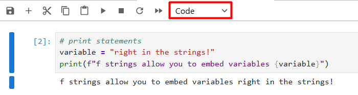

# Machine Learning

In traditional programming, humans write rigid explicit rules for computers to execute. **Machine Learning (ML)**, a subset of **Artificial Intelligence (AI)**, works differently: instead of manually coding fixed rules, we supply the system with large volumes of data, and the computer learns to derive underlying patterns and rules on its own.

## Learning Process

Teaching a machine is very similar to teaching a human:

1. **Collect Data**: We gather a lot of examples.
2. **Train the Model**: The computer looks at the data over and over again to find patterns.
3. **Test the Model**: We show the computer new examples it has never seen before to check if its guesses are correct. If it performs well, the model is ready to use.

## The Three Pillars of Machine Learning

Machine learning methods are divided into three main types based on how they receive data:

### Supervised Learning (Learning with Labels)

The model learns from historical data that already contains the correct answers. By feeding it inputs and their corresponding outputs, the model discovers the underlying rules to predict future results. 

This approach is widely used for **Regression** (predicting numerical values, like house prices) and **Classification** (categorizing items, such as filtering "Spam" from "Not Spam" emails).

### Unsupervised Learning (Finding Hidden Patterns)

The model is given raw, unlabeled data without any predefined answers. Its goal is to explore the data and uncover hidden structures on its own.

This is particularly useful for **Clustering** (grouping similar items, like segmenting customers by purchasing habits) and **Data Simplification** (reducing the complexity of large datasets).

### Reinforcement Learning (Trial and Error)

The model, acting as an agent, learns by directly interacting with an environment. It tries various actions and receives feedback in the form of rewards for good choices or penalties for mistakes. 

Over time, it optimizes its strategy to maximize the reward, making it the ideal method for training autonomous driving systems, robotic movements, and gaming AI.

# JupyterLab

Writing machine learning code is an ongoing experiment. You do not just write a program and leave it; you test data, make small adjustments, and test again. To do this easily, you need an interactive tool. Today, the standard choice is **JupyterLab**.

## The Notebook Format

In standard programming, you write a long file of code and run the whole thing from top to bottom. If there is an error at the very end, the computer stops, and you have to run the entire file all over again.

**JupyterLab** fixes this by using a **Notebook format** (`.ipynb`). It breaks your document into separate blocks called **Cells**. You can mix two types of cells on the same page:

- **Markdown Cells (Text)**: Used to write normal text, headings, and bullet points to explain your thought process.
    
  

- **Code Cells (Python)**: Used to write the actual code. When you run a code cell, the computer instantly displays the result directly underneath it.

  

## Getting Started

To install **JupyterLab**, simply open your command terminal and use Python's package manager:

`pip install jupyterlab`

Once installed, launch the application by typing:

`jupyter lab`

Your web browser will instantly open a clean, empty workspace, ready for your first machine learning project.