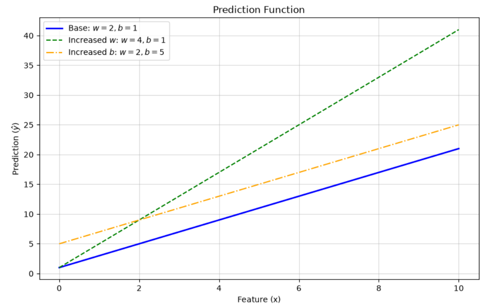
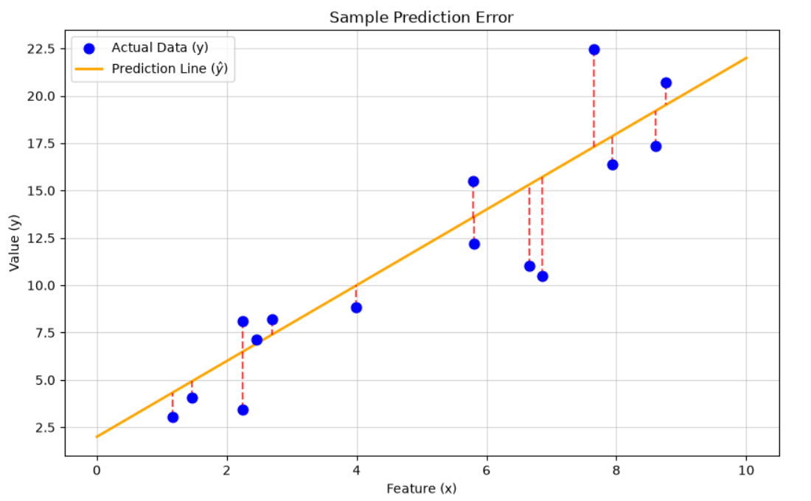
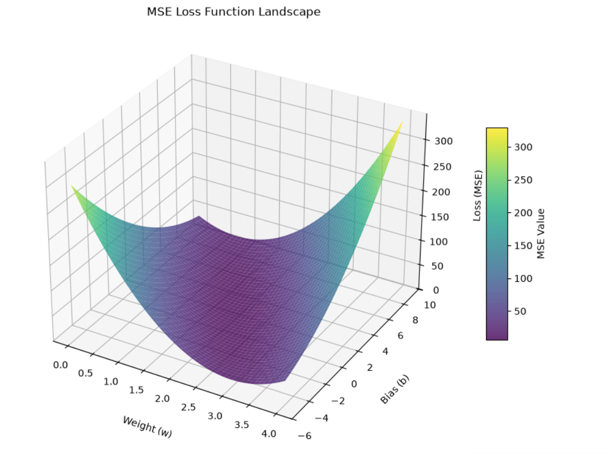

# Linear Regression

**Linear regression** is one of the simplest and most fundamental supervised machine learning algorithms. Its core goal is to find the optimal straight line to fit a set of input data and make accurate predictions.

## Model Structure

The **model structure** is the fixed mathematical framework (our basic "prediction tool.") The standard formula for univariate (single-variable) linear regression is:

$\hat{y} = wx + b$

To use this framework, we must define its components:

- **Feature** ($x$): The input data you feed into the model.
- **Prediction** ($\hat{y}$): The output the model gives you. The "hat" indicates it is a calculated guess, not necessarily the absolute truth.
- **Weights** ($w$): The parameter that controls the slope (steepness) of the line.
- **Bias** ($b$): The parameter that controls where the line crosses the y-axis (the starting point).

The structure of the linear regression model itself is fixed. The entire training process is simply about **finding the best possible values for $w$ and $b$**.

### Prediction Function

Once we lock in specific values for our parameters ($w$ and $b$), the structural formula becomes an active **prediction function**. For any input feature ($x$), we just plug it into the equation to calculate the predicted value ($\hat{y}$).

Here is how changing the parameters intuitively affects the prediction:

- **Increasing $w$**: The line becomes steeper, meaning the predicted value $\hat{y}$ changes more rapidly as $x$ increases.
- **Increasing $b$**: The entire line shifts upward, increasing all predicted values synchronously by the same amount.

## Sample Prediction Error

While the function gives us predictions, we need a way to measure how accurate they are. We do this by calculating the sample error.

**Error** is simply the difference between the true value and the model's predicted value for a single data point:

$\text{Error} = y - \hat{y}$
- $y$: The actual, true label of the sample.
- $\hat{y}$: The model's predicted guess.

Errors can be positive or negative. A positive error means the prediction was lower than the true value, while a negative error means it was higher. The larger the absolute value of the error, the worse the current parameters are performing on that specific sample.

## Loss Function (MSE)

A single sample error only evaluates one data point. To judge the overall performance of our parameters ($w$ and $b$) across all samples, we introduce the **Mean Squared Error (MSE) loss function**.

The formula for the MSE loss function is:

$J(w,b) = \frac{1}{m}\sum\limits_{i=1}^m (y^{(i)} - \hat{y}^{(i)})^2$

- $m$: The total number of training samples.
- $i$: The index of a specific sample.
- $J(w,b)$: The overall loss value, which depends entirely on our chosen $w$ and $b$.

**Squaring the errors** serves two vital purposes. First, it turns all positive and negative errors into non-negative values, preventing them from canceling each other out. Second, squaring amplifies large mistakes, which heavily penalizes wildly inaccurate predictions.

Ultimately, the loss function acts as a **grading rubric**. A smaller loss value means our parameters ($w$ and $b$) are appropriate and the model fits the data well. The absolute minimum possible loss is $0$, which represents perfect, flawless prediction.

