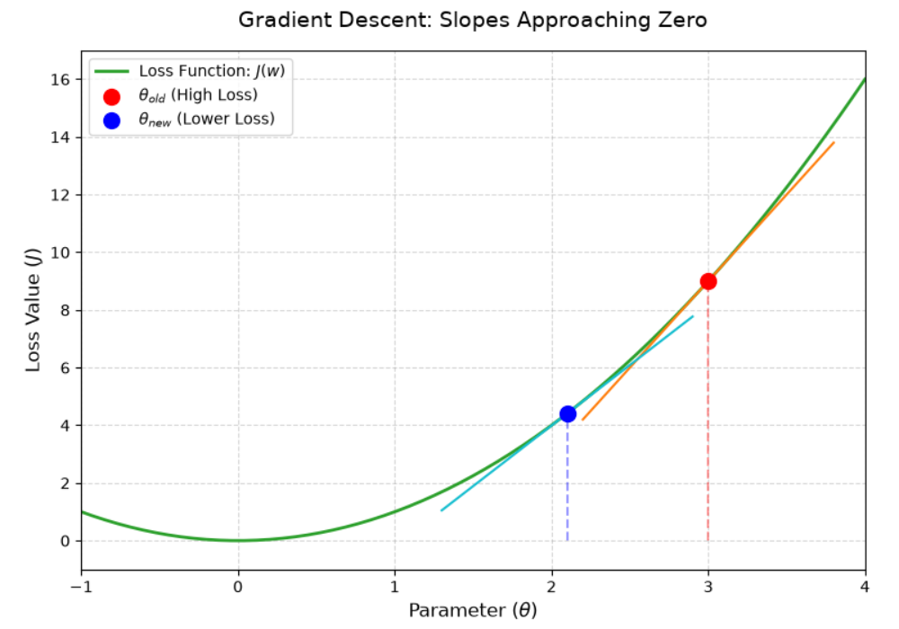
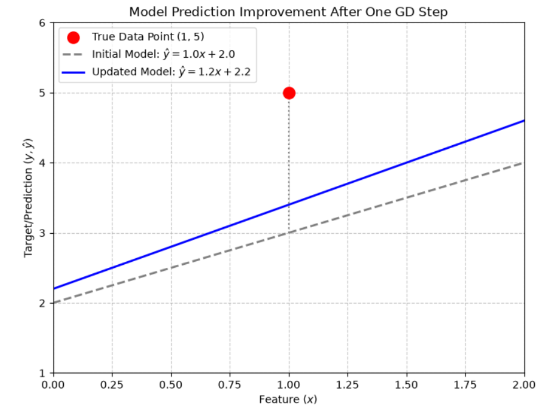

# Gradient Descent

Let's quickly review a few foundational concepts, using **linear regression** and the **Mean Squared Error (MSE) loss function** as our examples:

- **Model structure**: A mathematical framework with adjustable parameters, such as $\hat{y} = wx + b$.
- **Model**: A specific mathematical function with fixed parameters, such as $\hat{y} = 2x + 5$.
- **Sample error**: The difference between the model's prediction and the true target value, such as $\text{Error} = \hat{y} - y$.
- **Loss function**: A scoring metric used to evaluate the model's overall performance. A lower score means a better fit, such as $J(w,b) = \frac{1}{m}\sum\limits_{i=1}^m (\hat{y}^{(i)} - y^{(i)})^2$.
- **Training**: The process of finding a set of optimal parameters that minimize the loss value.

With these concepts in mind, a critical question arises: **how do we actually train the model to find those optimal parameters?** This is where **gradient descent** comes in. It is the optimization algorithm that provides the model with exact instructions on how to update its parameters to improve predictions.

## Mathematical Basis

Before diving into the mechanics of gradient descent, it is helpful to understand the basic calculus concepts that make this algorithm possible.

### Derivative

At its simplest, a **derivative** measures the rate of change of a function containing a single variable. Geometrically, it represents the slope of the tangent line at a specific point on a curve, telling you whether the function's value is currently trending up or down.

To calculate these slopes, we rely on a few foundational rules:

- **Power Rule**: If $f(x) = x^n$, the derivative is $nx^{n-1}$. For example, the derivative of $x^2$ is $2x$.
- **Constant Rule**: The derivative of a standalone constant number (like $5$ or $10$) is always $0$, because a constant never changes.

### Partial Derivative

Building on that concept, when a function relies on multiple variables (like our loss function with $w$ and $b$), we use **partial derivatives**. A partial derivative measures how the function's output changes when you tweak just one variable while temporarily freezing all the others (treating them as constants).

For a quick example, imagine a function $f(x, y) = x^2 + 3y$:
- To find the partial derivative with respect to $x$, we treat $3y$ as a constant (so its derivative becomes $0$). The result is just $2x$.
- To find the partial derivative with respect to $y$, we treat $x^2$ as a constant (becoming $0$). The result is just $3$.

### Gradient

Finally, bringing it all together, the **gradient** is simply a collection (a mathematical vector) of all the partial derivatives of a function. For our loss function with parameters $w$ and $b$, the gradient is written like this: $\nabla J(w,b) = \begin{bmatrix} \frac{\partial J}{\partial w} \\ \frac{\partial J}{\partial b} \end{bmatrix}$

If you imagine standing on a hilly landscape, this mathematical gradient always points in the direction of the steepest ascent (uphill).

## The Core Update Formula

Armed with an understanding of gradients, we can now look at the engine of the algorithm. Gradient descent operates on one fundamental, repeating formula:

$$\theta_{\text{new}} = \theta_{\text{old}} - \eta \nabla J(\theta)$$

- $\theta$ (Theta): A placeholder representing any parameter we want to update (such as $w$ or $b$).
- $\nabla J(\theta)$: The gradient of the loss function. This calculates the steepness and direction of the slope at our current position.
- $-$ (Minus sign): This is a crucial mathematical lever. Because the gradient always points uphill, subtracting it forces our update to move against the slope, ensuring we step downhill toward the minimum loss.
- $\eta$ (Eta): The learning rate.

### The Learning Rate ($\eta$)

The **learning rate** is a configuration setting you must define before training begins. It controls the size of the step the algorithm takes down the hill.

Choosing the right learning rate is a balancing act:
- If $\eta$ is too small, the model takes tiny steps. It will eventually reach the minimum loss, but the training process will be highly inefficient and slow.
- If $\eta$ is too large, the model takes massive leaps. It might completely overshoot the lowest point and bounce back and forth across the valley, failing to ever minimize the loss.

## Mathematical Derivation (Applying to MSE)

To see how this formula works in practice, let us apply **gradient descent** to our **linear regression model**.

First, to make the calculus cleaner, we slightly modify the standard MSE formula by adding a 2 to the denominator. This mathematical trick does not change where the minimum loss is located; it simply makes the derivative easier to calculate.

Modified Loss Function:$$J(w,b) = \frac{1}{2m} \sum\limits_{i=1}^{m} (\hat{y}^{(i)} - y^{(i)})^2$$

Using the chain rule, we calculate the partial derivatives of this loss function with respect to $w$ and $b$. Because we added the 2 to the denominator, the exponent 2 drops down during derivation and perfectly cancels it out.

Partial derivative for $w$:$$\frac{\partial J}{\partial w} = \frac{1}{m} \sum_{i=1}^{m} (\hat{y}^{(i)} - y^{(i)}) \cdot x^{(i)}$$

Partial derivative for $b$:$$\frac{\partial J}{\partial b} = \frac{1}{m} \sum_{i=1}^{m} (\hat{y}^{(i)} - y^{(i)})$$

Finally, we plug these calculated gradients back into our core update formula. The resulting two equations are the exact mathematical instructions the computer executes repeatedly during the training loop to optimize the model:

$$w_{\text{new}} = w_{\text{old}} - \eta \frac{1}{m} \sum_{i=1}^{m} (\hat{y}^{(i)} - y^{(i)}) \cdot x^{(i)}$$

$$b_{\text{new}} = b_{\text{old}} - \eta \frac{1}{m} \sum_{i=1}^{m} (\hat{y}^{(i)} - y^{(i)})$$

### Manual Calculation Example

Let's run one single iteration by hand.
- **Data**: One sample ($m=1$). Feature $x = 1$, true label $y = 5$.
- **Initial State**: $w = 1$, $b = 2$.
- **Learning Rate**: $\eta = 0.1$.

#### Step 1: Calculate Current Prediction & Error
- $\hat{y} = (1)(1) + 2 = 3$
- $\text{Error} = \hat{y} - y= 3 - 5 = -2$

#### Step 2: Calculate Gradients
- $\frac{\partial J}{\partial w} = (-2) \cdot (1) = -2$
- $\frac{\partial J}{\partial b} = -2$

#### Step 3: Update Parameters
- $w_{\text{new}} = 1 - 0.1(-2) = 1.2$
- $b_{\text{new}} = 2 - 0.1(-2) = 2.2$

After just one step, our parameters updated from $(1, 2)$ to $(1.2, 2.2)$. If we predict again for $x=1$, our new $\hat{y}$ is $1.2(1) + 2.2 = 3.4$. The model has moved from predicting $3$ to predicting $3.4$, stepping closer to the true value of $5$. It is officially learning!

