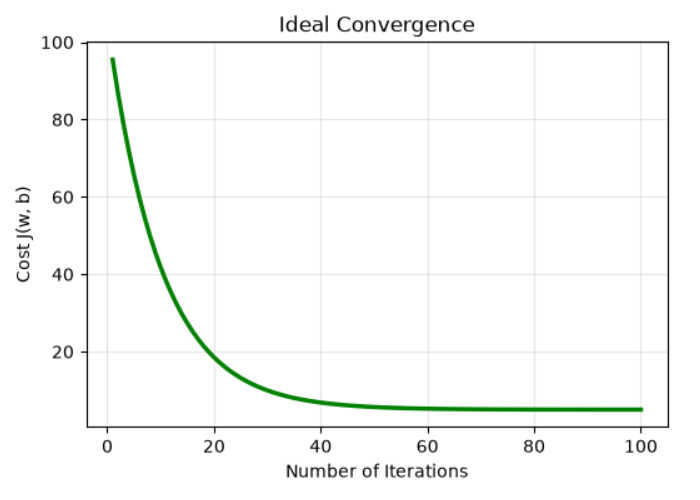
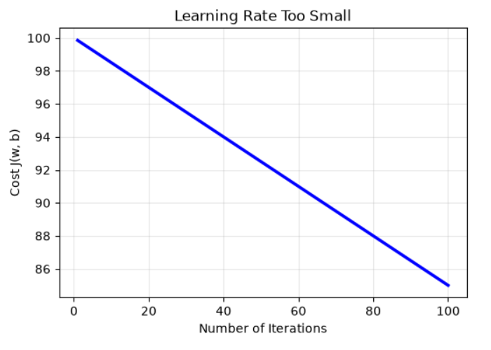
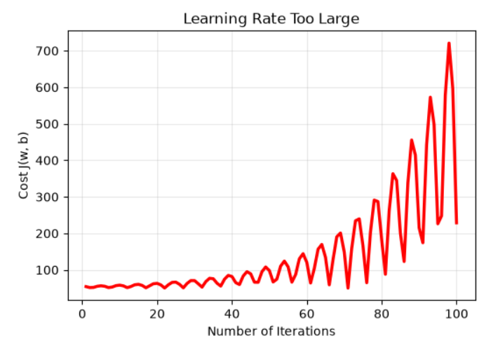

# Multiple Linear Regression

In **simple linear regression** $f_{w,b}(x) = wx + b$, we predict an outcome using **a single feature** $x$. However, real-world problems usually involve multiple factors. For example, when predicting a house price, size alone is not enough. Other factors such as the age of the house, the number of bedrooms, and the distance to the subway can also affect the price.

By using **multiple features**, the model can capture more complex relationships and often make more accurate predictions.

## Vectorization

With **multiple features**, the model needs a separate weight for each feature to represent its importance. The prediction function becomes:

$$f_{\vec{w},b}(\vec{x}) = w_1x_1 + w_2x_2 + \dots + w_nx_n + b$$

Writing and calculating this long expression directly is inconvenient and inefficient. To simplify the notation and improve performance, we use **vectorization**.

We group all weights into a **parameter vector**:

$$\vec{w} = [w_1, w_2, \dots, w_n]^T$$

and all feature values into a **feature vector**:

$$\vec{x} = [x_1, x_2, \dots, x_n]^T$$

Using the **dot product**, the prediction function can be written more compactly as:

$$f_{\vec{w},b}(\vec{x}) = \vec{w} \cdot \vec{x} + b$$

Vectorization not only makes the math cleaner, but also improves computational efficiency. Libraries such as **NumPy** can perform vector operations using optimized low-level implementations, allowing calculations to run much faster than explicit loops.

## Cost Function and Gradient Descent

The concepts of **Cost Function** and **Gradient Descent** remain the same as in simple linear regression. The main difference is that we now optimize a parameter vector $\vec{w}$ instead of a single weight $w$.

The cost function becomes:

$$J(\vec{w},b) = \frac{1}{2m} \sum_{i=1}^{m} \left(f_{\vec{w},b}(\vec{x}^{(i)}) - y^{(i)}\right)^2$$

The goal is still to find the values of $\vec{w}$ and $b$ that minimize the cost.

To achieve this, **Gradient Descent** updates all **weights** and the **bias** simultaneously. For the $j$-th feature, the update rules are:

$$w_j = w_j - \eta \frac{\partial}{\partial w_j} J(\vec{w},b)$$

$$b = b - \eta \frac{\partial}{\partial b} J(\vec{w},b)$$

where $\eta$ is the learning rate, which controls the size of each update step.

## Convergence Curve

A useful way to monitor training is to plot **the number of iterations** on the X-axis and **the cost $J(\vec{w},b)$** on the Y-axis. This produces a convergence curve, which helps evaluate the behavior of **Gradient Descent**.

### Ideal Convergence

The cost decreases rapidly at the beginning and then gradually levels off. This indicates that the algorithm is converging toward a minimum and learning successfully.

### Learning Rate Too Small

The cost decreases very slowly and may appear as a long, nearly straight downward line. In this case, **Gradient Descent** is working, but it requires many iterations to reach a good solution.

### Learning Rate Too Large

The cost fluctuates significantly, oscillates, or even increases over time. This happens because the update steps are too large, causing the algorithm to overshoot the minimum repeatedly instead of converging.

