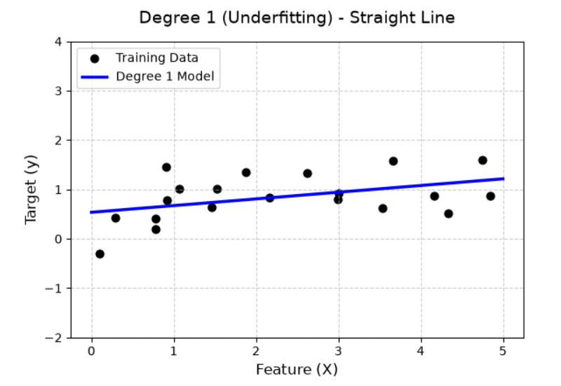
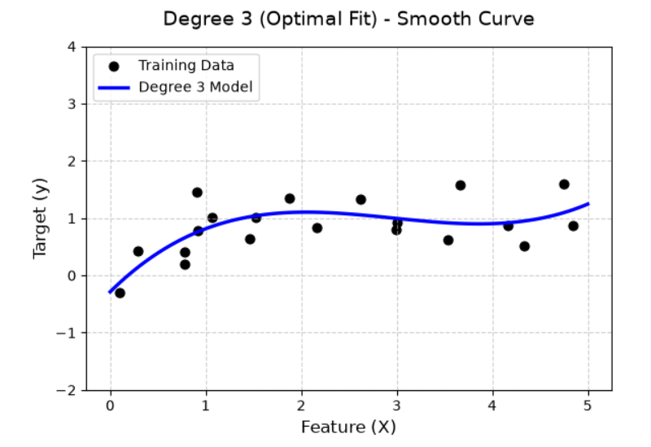
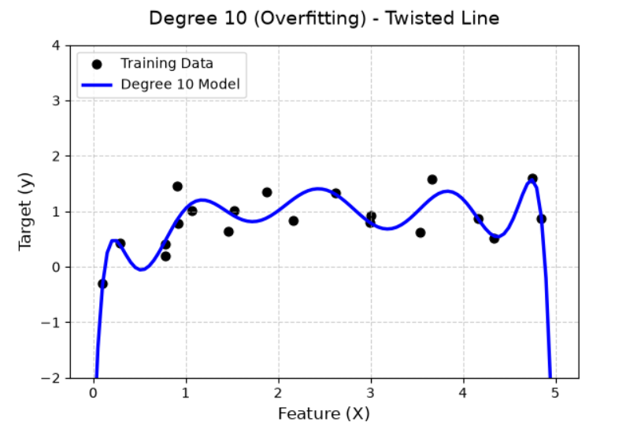
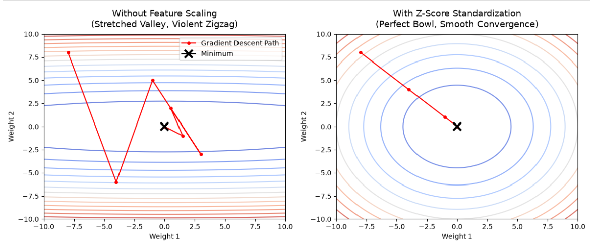
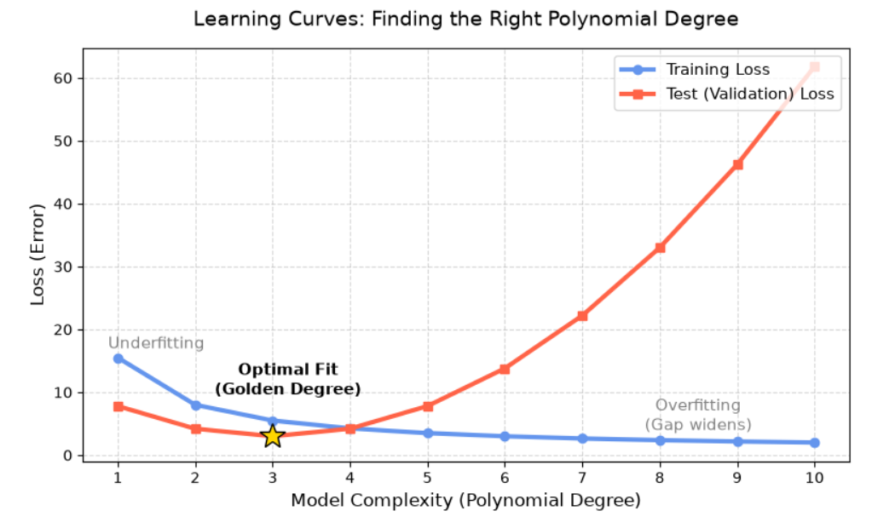

# Polynomial Regression

When dealing with real-world data, the relationship between **features** (like house size) and **targets** (like house price) is rarely a perfect straight line. Sometimes prices accelerate, and sometimes they plateau. To capture these trends, we must step beyond basic straight lines and introduce **Polynomial Regression**.

## Mathematical Definition

In a standard simple linear regression, the model attempts to draw a straight line through the data. The mathematical equation looks like this:

$$y = wx + b$$

However, when data exhibits a curve, a straight line is too rigid. We can "bend" this line by introducing higher-power terms (polynomial terms) of our original feature $x$. For example, a 2nd-degree polynomial regression looks like this:

$$y = w_1x + w_2x^2 + b$$

By simply adding an $x^2$ term, the mathematical boundary transforms from a flat line into a curve (a parabola), allowing the model to adapt to accelerating or decelerating trends.

### Visual Comparison

Choosing the right "degree" (the highest power of $x$) drastically changes how the model behaves. Let's look at three classic scenarios:

**Degree 1 (Straight Line)**: The model is too simple and misses the underlying curve. This is called **Underfitting**.

**Degree 2 or 3 (Smooth Curve)**: The model perfectly captures the general trend of the data in a natural, smooth way. This is the **Optimal Fit**.

**Degree 10 (Twisted Line)**: The model becomes hyper-sensitive, wildly twisting up and down to pass through every single data point. It loses its predictive power for future data. This is called **Overfitting**.

## Feature Engineering

**Polynomial regression** does not actually use a brand-new, complex algorithm. Instead, it relies on a brilliant "magic trick" during the Feature Engineering stage.

### Feature Creation

Machine learning algorithms like **Gradient Descent** are highly optimized for solving linear problems. So, how do we force them to solve a curved polynomial problem? We do it by artificially **creating new features**.

Suppose we want to fit a 3rd-degree polynomial curve based on a single feature, $x$. The target equation looks like this:

$$y = w_1x + w_2x^2 + w_3x^3 + b$$

To make this solvable for linear algorithms, we can artificially generate new dimensions out of our original $x$:

Let $x_1 = x$

Let $x_2 = x^2$

Let $x_3 = x^3$

Now, we substitute these new variables back into our original equation:

$$y = w_1x_1 + w_2x_2 + w_3x_3 + b$$

Notice the brilliant trick here? To the algorithm, this is no longer a complex curve, it is simply a standard **Multiple Linear Regression** model with three distinct features. Thanks to this feature creation, we can seamlessly apply classic algorithms like **Gradient Descent** to calculate the weights and find the minimum loss.

### Feature Scaling

Because we are creating higher-power features, we introduce a fatal numerical problem.

Imagine a house size is 100 square meters.

$x = 100$

$x^2 = 10,000$

$x^3 = 1,000,000$

This extreme numerical gap creates a stretched, narrow "valley" in the loss function. When **Gradient Descent** tries to update the weights, it will bounce back and forth violently and struggle to converge.

To fix this, we use **Feature Scaling** to compress all features into a similar, healthy numerical range. There are two standard approaches in the industry:
- **Min-Max Scaling (Normalization)**: This forces all data strictly into a range between 0 and 1 using the formula $x_{scaled} = \frac{x - x_{min}}{x_{max} - x_{min}}$. While useful for naturally bounded data (like image pixels), it is highly vulnerable to outliers.
- **Z-Score Scaling (Standardization)**: This transforms the data to have a mean ($\mu$) of 0 and a standard deviation ($\sigma$) of 1 using the formula $x_{scaled} = \frac{x - \mu}{\sigma}$. It is incredibly robust and is the absolute favorite of gradient-based algorithms.

For polynomial regression, we must apply **Z-Score Standardization** (usually via StandardScaler). This puts all features (whether it is $x$ or $x^3$) on an equal playing field. In this context, feature scaling is not optional; it is strictly required.

 
## Finding the Right Degree

How do we decide if we should use a 2nd-degree, 3rd-degree, or 4th-degree polynomial?

### The Lie of Training Loss
It is a common beginner mistake to train multiple models and pick the one with the lowest training loss.

If you use a 10th-degree polynomial, the model will have enough flexibility to perfectly touch every single point in your dataset. The training loss will drop closer to zero. However, this model is essentially "memorizing" the data rather than learning the actual pattern. When you ask it to predict the price of a new house, it will fail miserably.

### The Holdout Method: 80/20 Split

To find the true optimal degree, we must test the model on data it has never seen before. We do this by splitting our dataset:

**Training Set (e.g., 80%)**: Used strictly as "practice material" to train the model's weights.

**Test/Validation Set (e.g., 20%)**: Kept completely hidden during training. Used as a "final exam" to evaluate the model.

### The Ultimate Judge: Minimum Test Loss

To lock in the "**Golden Degree**," we need to systematically evaluate different models. Here is the standard workflow:

- **Test Degree 1**: Train a linear model using the 80% training data, then calculate its loss on the hidden 20% test data.

- **Test Higher Degrees**: Repeat this exact process for Degree 2, Degree 3, and beyond.

- **Compare the Results**: You will typically observe a pattern like the one below:

| Model Complexity | Training Loss | Test (Validation) Loss | Verdict           |
| :--------------- | :------------ | :--------------------- | :---------------- |
| Degree 1         | High          | High                   | Underfitting      |
| Degree 2         | Medium        | Lowest Point           | Optimal Structure |
| Degree 10        | Near Zero     | Extremely High         | Overfitting       |

**The Golden Rule**: Reject memorization. Always select the polynomial degree that achieves the minimum loss on the unseen 20% Test Set.

By following this rule, you ensure that the model has actually learned the underlying pattern of the data, rather than just mechanically memorizing the training set.

