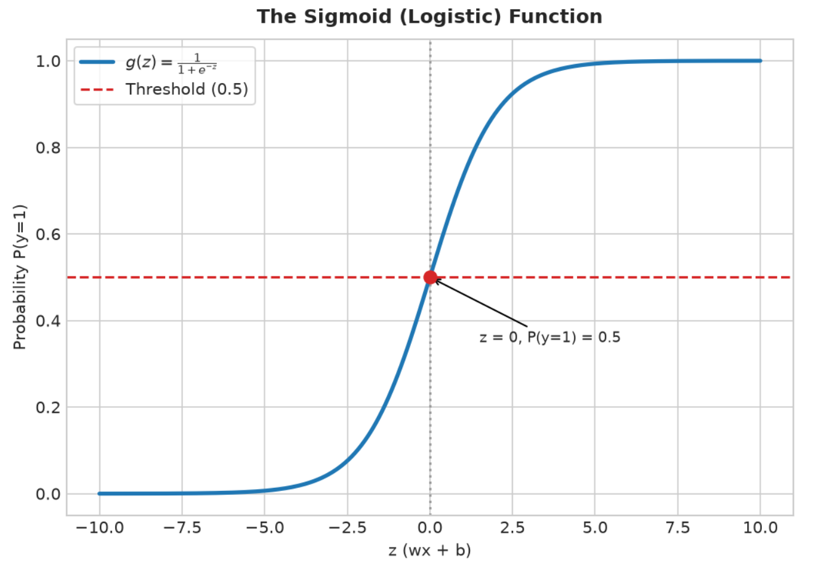
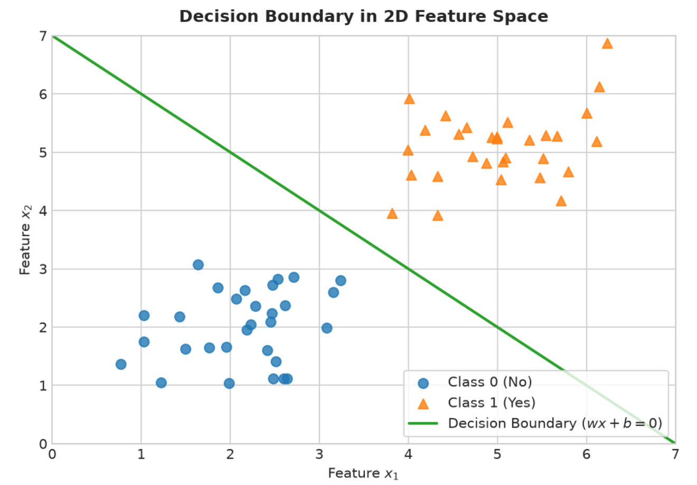
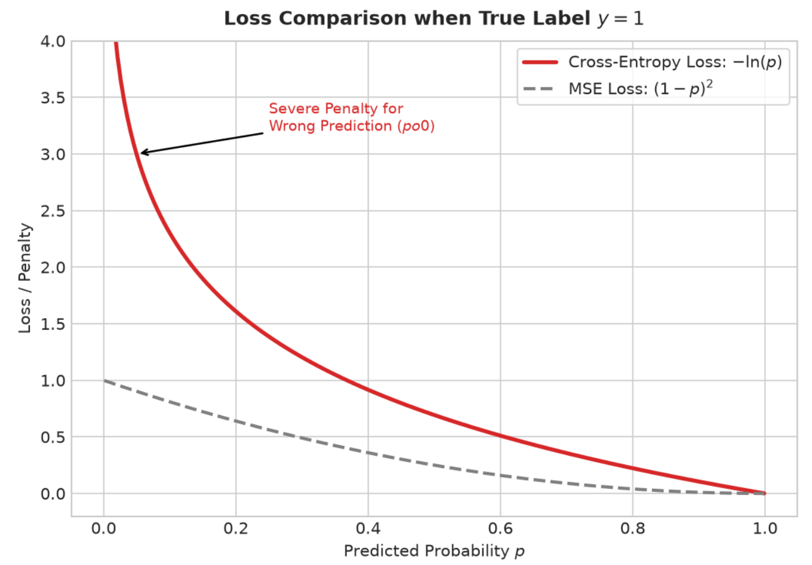
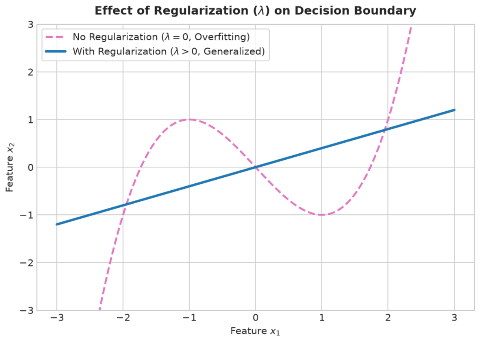

# Logistic Regression

When predicting real-world outcomes, we don't always want a continuous number like house prices. Often, we just need a simple, hard answer: Yes or No? Is this email spam? Is this transaction fraudulent? Is this tumor malignant? To tackle these **binary classification** problems, we must step beyond standard lines and introduce **Logistic Regression**.

## Mathematical Definition

To understand how it works, we first start with a basic **linear equation**:

$\displaystyle z = wx + b$

The problem with a pure linear equation is that its **output ($z$)** can be any number from negative infinity to positive infinity. For binary classification, we need a probability, which must strictly live between 0 and 1.

To solve this, we pass our linear output through a mathematical "squasher" called the **Sigmoid function** (or **Logistic function**):

$\displaystyle g(z) = \frac{1}{1+e^{-z}}$

By applying this transformation, we squash any output into a 0-to-1 range. The final output of our model becomes $f(x) = P(y=1\vert{}x; w, b)$. In plain terms, this is the probability that the result is 1, given the **features ($x$)** and our **model parameters ($w, b$)**.

## The Decision Boundary

Once the model gives us a probability (for example, 0.85), how do we make the final "Yes" or "No" call? We set a threshold, typically at 0.5.

- If $P(y=1) < 0.5 \rightarrow \text{Predict 0 (No)}$
- If $P(y=1) \ge 0.5 \rightarrow \text{Predict 1 (Yes)}$

If you look closely at the **Sigmoid function**, the probability is exactly 0.5 when $z = 0$. Therefore, the underlying equation $wx + b = 0$ creates a dividing line between our two categories. We call this the **Decision Boundary**. It is the geometric boundary (a line in 2D, or a hyperplane in higher dimensions) that perfectly separates our classes when the weights ($w$) and bias ($b$) are locked in.

## Evaluating the Model

To train an algorithm, we need a **loss function** to measure its mistakes.

### The Trap of Mean Squared Error

In standard **linear regression**, we use **Mean Squared Error (MSE)**. However, applying MSE to Logistic Regression is a fatal mistake. Because our prediction ($p$) is always a tiny decimal between 0 and 1, the calculated MSE loss will also be tiny. The "punishment" for a wrong prediction would be too weak, creating a bumpy, non-convex landscape where optimization algorithms like **Gradient Descent** get hopelessly stuck.

### The Solution: Logistic Loss

To fix this, we introduce the **Logistic Loss Function** (also known as **Cross-Entropy Loss**):

$\displaystyle \text{loss} = -[y \ln(p) + (1-y)\ln(1-p)]$

This logarithmic formula acts as a strict teacher. If the model makes a highly confident but wrong prediction, the logarithmic punishment shoots up drastically. The overall cost function for the entire dataset is simply the average of these individual losses:

$\displaystyle J(w,b) = -\frac{1}{m} \sum \text{loss}$

By combining Cross-Entropy with Sigmoid, we create a smooth, bowl-shaped **convex landscape**. This guarantees that **Gradient Descent** will always find the global minimum, updating the weights ($w$) and bias ($b$) proportionally to the prediction error without getting trapped.

## Addressing Overfitting: Regularization

Sometimes, a model trains too well. It memorizes the training data perfectly, drawing a bizarre, highly twisted decision boundary just to capture every single point (including random noise). This is called **Overfitting**, and it destroys the model's ability to predict new data.

To fight this, you can **collect more data** or **drop irrelevant features**. But the most powerful mathematical defense is **Regularization**.

### The Penalty Mechanism

Regularization works by adding a "penalty" term directly to our cost function. Instead of just minimizing the training mistakes, the model must now **minimize the loss plus the size of its weights**.

The updated cost function conceptually looks like this:

$\displaystyle J(w,b) = \left( -\frac{1}{m} \sum \text{loss} \right) + \text{Penalty}$

By forcing the **weights** ($w$) to be small, we prevent any single feature from aggressively hijacking the prediction. The strength of this penalty is controlled by a tuning dial called $\lambda$ (lambda). 

- If $\lambda$ is heavily increased, the penalty is huge, and the weights shrink close to zero. 
- If $\lambda$ is exactly zero, the penalty disappears, and we are back to a standard, overfitting-prone Logistic Regression.

There are two standard formulas used in the industry to calculate this penalty:

### L1 Regularization (Lasso)

L1 penalizes the absolute value of the weights. The mathematical equation updates to:

$\displaystyle J(w,b) = -\frac{1}{m} \sum_{i=1}^{m} \text{loss}^{(i)} + \frac{\lambda}{m} \sum_{j=1}^{n} \vert{}w_j\vert{}$

**Real-World Effect**: L1 is ruthless. It will shrink the weights of less important features down to exactly 0. Because it completely eliminates useless features, L1 acts as an automatic feature selection tool, leaving you with a clean, sparse model.

### L2 Regularization (Ridge)

L2 penalizes the squared value of the weights. The mathematical equation updates to:

$\displaystyle J(w,b) = -\frac{1}{m} \sum_{i=1}^{m} \text{loss}^{(i)} + \frac{\lambda}{2m} \sum_{j=1}^{n} w_j^2$

**Real-World Effect**: L2 is the industry default. Because of the squared term, it heavily punishes massive weights but gets very gentle as the weights get closer to zero. It shrinks the weights evenly but rarely reduces them to absolute zero. This keeps the model incredibly smooth, stable, and robust against outliers.

**The Golden Rule**: By applying regularization, we force the decision boundary to remain gentle and generalized. It sacrifices a tiny bit of training accuracy to ensure the model performs perfectly on unseen data in the real world.