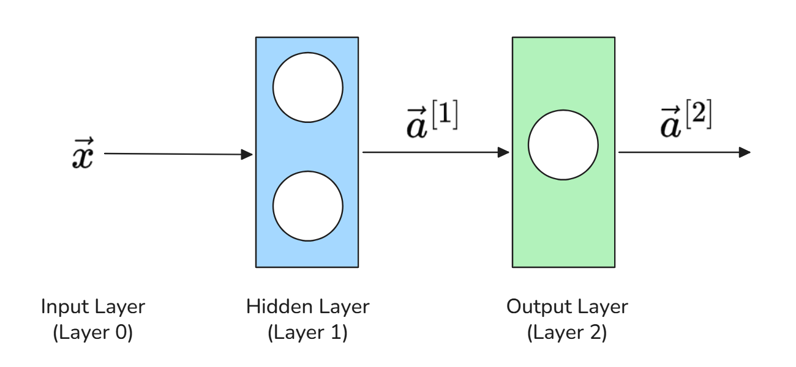
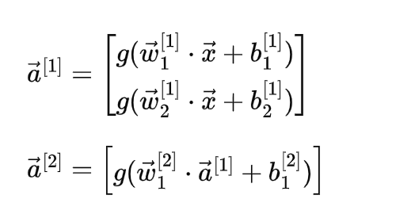
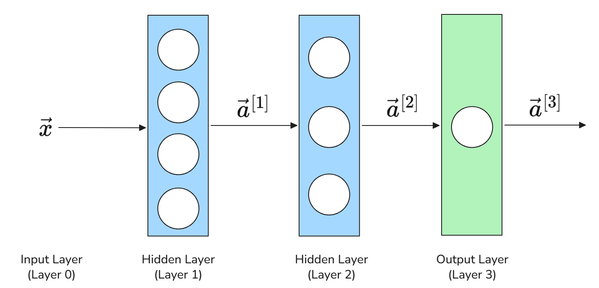
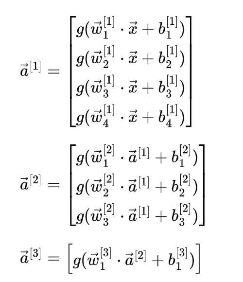

# Neural Network

While **Logistic Regression** works well for simple linear problems, real-world tasks (such as recognizing a face, translating speech, or driving a car) involve complex, non-linear patterns. To solve them, we turn to **Neural Networks**.

## A Single Neuron

At its core, an Artificial Neural Network is built from fundamental processing units called **Neurons** (or nodes). A single neuron operates almost identically to a Logistic Regression unit through two sequential steps:

### Step 1: Linear Combination

The neuron takes input values ($\vec{x}$), multiplies each by a learned weight ($\vec{w}$), sums them up, and adds a bias ($b$):

$$\displaystyle z = \vec{w} \cdot \vec{x} + b = \sum_{j=1}^{n} w_j x_j + b$$

- **Weights** ($\vec{w}$): Scale the importance of each incoming feature.
- **Bias** ($b$): Shifts the activation threshold up or down.

### Step 2: Non-Linear Activation

Next, the raw score $z$ passes through an **Activation Function** $g(z)$ to produce the final output (called its **activation**, $a$):

$$\displaystyle a = g(z)$$

### Why Do We Need Activation Functions?

Without non-linear activation functions, stacking multiple layers would mathematically collapse back into a single linear equation:

$$\displaystyle \text{Linear}(\text{Linear}(x)) = \text{Linear}(x)$$

Activation functions inject **non-linearity,** enabling the network to learn complex decision boundaries. Common choices include:

| Function  | Formula | Usage                                                                                                                                                                            | 
|:---|:---|:---------------------------------------------------------------------------------------------------------------------------------------------------------------------------------|
| **Sigmoid**   | $g(z) = \frac{1}{1 + e^{-z}}$ | Squashes values into $(0, 1)$. Primarily used in the output layer for binary classification.                                                                                     |
| **ReLU**    | $g(z) = \max(0, z)$ | Sets negative inputs to $0$ and leaves positive inputs unchanged. Default choice for hidden layers due to fast computation.                                                      |
| **Softmax**   | $g(z_i) = \frac{e^{z_i}}{\sum_{j} e^{z_j}}$ | $g(z_i) = \frac{e^{z_i}}{\sum_{j} e^{z_j}}$Converts raw score outputs into a probability distribution that sums to $1$. Used in the output layer for multi-class classification. |

---

## Network Architecture

By connecting individual neurons in sequential Layers, we form a full Artificial Neural Network (ANN).

Every architecture consists of three functional parts:
- **Input Layer**: Receives raw features ($\vec{x} = [x_1, x_2, \dots, x_n]^T$), such as image pixels or physical measurements.
- **Hidden Layers**: Intermediate layers located between input and output. They automatically extract increasingly abstract features from the data.
- **Output Layer**: Produces the final prediction ($a^{[L]}$ or $\hat{y}$), such as a classification label or a continuous value.

### Single-Hidden-Layer Neural Network

Consider a shallow network consisting of an input feature vector ($\vec{x}$), $1$ hidden layer with $2$ neurons, and $1$ output layer:

### Deep Neural Network (Multi-Layer Architecture)

Consider a deeper architecture with an input feature vector ($\vec{x}$), $2$ sequential hidden layers (with $4$ and $3$ neurons, respectively), and $1$ output layer:

