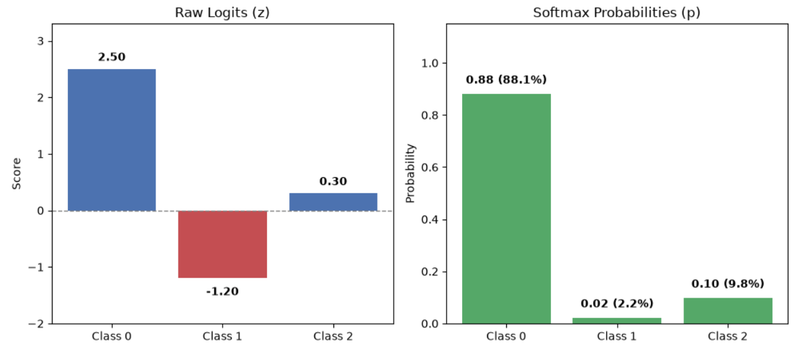
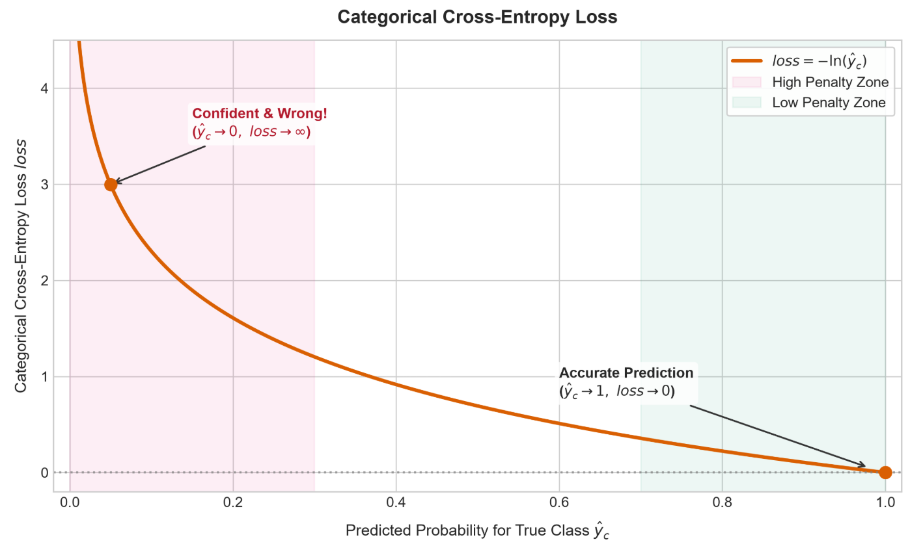

# Softmax Regression

In **Logistic Regression**, we solve **binary classification problems** where the output is a simple "Yes" or "No" (1 or 0). However, real-world problems often involve choosing between multiple categories. Is this handwritten digit a 0, 1, 2, or 9? Is this news article about sports, politics, or tech?

To tackle these problems, we extend Logistic Regression into **Softmax Regression** (also known as **Multinomial Logistic Regression**).

## Multi-Class & One-Hot Encoding

Before building a model, we need a mathematical way to represent **multi-class** targets.

Suppose we have a classification task with $K$ possible classes. Instead of representing the true label $y$ as a single integer (e.g., class 2), we represent it as a One-Hot Vector $\mathbf{y}$ of length $K$.

A **One-Hot vector** has a 1 at the index of the correct class and 0 everywhere else.

For example, in a 3-class problem (0: Cat, 1: Dog, 2: Bird), if the true label is Dog (class 1), its One-Hot vector is:

$$\mathbf{y} = \begin{bmatrix} 0 \\ 1 \\ 0 \end{bmatrix}$$

This vector represents the ground-truth probability distribution: $P(\text{Dog}) = 1.0$, while all other classes have $P = 0.0$.

## Softmax Function

Now that our target $\mathbf{y}$ is a vector of $K$ probabilities, our model must output a matching vector of $K$ predicted probabilities, $\hat{\mathbf{y}} \in \mathbb{R}^K$.

First, Softmax Regression calculates a raw, unnormalized score (called a **logit**) for each class:

$$z_k = \mathbf{w}_k^T \mathbf{x} + b_k, \quad \text{for } k = 1, 2, \dots, K$$

Or in compact matrix form:

$$\mathbf{z} = \mathbf{W} \mathbf{x} + \mathbf{b}$$

Where:

- $\mathbf{x} \in \mathbb{R}^d$ is your input **feature vector**.
- $\mathbf{W} \in \mathbb{R}^{K \times d}$ and $\mathbf{b} \in \mathbb{R}^K$ are the **weights** and **biases** for all $K$ classes.
- $\mathbf{z} \in \mathbb{R}^K$ contains the **logits** for each class.

Raw **logits** $z_k$ can range from $-\infty$ to $+\infty$. To convert them into valid probabilities (where every value stays between 0 and 1, and all values sum to 1) we pass the logits through the Softmax function:

$$\hat{y}_k = P(y=k \mid \mathbf{x}) = \frac{e^{z_k}}{\sum_{j=1}^{K} e^{z_j}}$$

The Softmax function performs two key tasks:

- **Exponentiation** ($e^{z_k}$): Forces all outputs to be positive and exponentially amplifies differences between scores.
- **Normalization** ($\sum e^{z_j}$): Divides each term by the sum of all terms so the final vector sums to exactly 1.

Note: When $K = 2$, **Softmax Regression** simplifies mathematically to standard **Logistic Regression**, and the **Softmax function** becomes the **Sigmoid function**.

## Categorical Cross-Entropy

Now that both the true target $\mathbf{y}$ and predicted output $\hat{\mathbf{y}}$ are probability distributions in $\mathbb{R}^K$, we measure the distance between them using Categorical Cross-Entropy Loss:

$$\text{loss}(\mathbf{y}, \hat{\mathbf{y}}) = -\sum_{k=1}^{K} y_k \ln(\hat{y}_k)$$

Because $y_k = 1$ for the true class $c$ and $y_k = 0$ for all other classes, the summation collapses to punishing the model solely on its predicted confidence for the correct class:

$$\text{loss} = -\ln(\hat{y}_c)$$

- If the model predicts $\hat{y}_c = 1.0$ (perfect confidence), $\text{loss} = -\ln(1.0) = 0$.
- If the model predicts $\hat{y}_c \to 0$ (confident but wrong), $\text{loss} \to \infty$.

The cost function across a dataset (or batch) of $m$ samples is the average loss:

$$J(\mathbf{W}, \mathbf{b}) = -\frac{1}{m} \sum_{i=1}^{m} \sum_{k=1}^{K} y_k^{(i)} \ln\left(\hat{y}_k^{(i)}\right)$$

## Elegant Gradient Update

When computing the derivative of **Categorical Cross-Entropy** Loss with respect to the $k$-th logit $z_k$, the mathematics yields a remarkably clean result:

$$\frac{\partial \text{loss}}{\partial z_k} = \hat{y}_k - y_k$$

The gradient vector is simply: **Predicted Probability - True Target**.

During backpropagation, Gradient Descent updates the parameters proportionally to this error vector:

- Large errors (e.g., predicting $\hat{y}_c = 0.1$ when $y_c = 1.0$) produce a large gradient ($\hat{y}_c - y_c = -0.9$), triggering aggressive parameter updates.
- Near-accurate predictions produce a tiny gradient, resulting in minimal fine-tuning.

## Practical Considerations

When implementing Softmax in real-world code (e.g., NumPy or PyTorch), two key considerations make model training stable and inference fast.

### Numerical Stability (The Log-Sum-Exp Trick)

Computing $e^{z_k}$ directly can cause **exponential overflow** when logits $z_k$ are large:
- **Float16**: Overflows to `inf` when $z > 11.09$.
- **Float32**: Overflows to `inf` when $z > 88.7$.

When $e^z \to \text{inf}$, calculating $\frac{\text{inf}}{\text{inf}}$ produces `NaN`, which corrupts training.

To prevent this, Softmax uses its **shift-invariance property**: subtracting any constant from all logits leaves the output probabilities unchanged. By subtracting the maximum logit $M = \max(\mathbf{z})$, all exponent inputs stay $\le 0$, ensuring $e^{z_k - M} \le 1$:

$$\hat{y}_k = \frac{e^{z_k - M}}{\sum_{j=1}^{K} e^{z_j - M}}$$

### Inference & Decision Rule

In the **training phase**, Softmax is required to calculate probabilities, Cross-Entropy Loss, and gradients.

In the **inference (prediction) phase**, we only care about picking the class with the highest score. Because $f(z) = e^z$ is **strictly monotonic** (larger inputs always produce larger outputs), Softmax preserves the exact relative ranking of raw logits. 

Therefore, we can skip computing $e^z$ and the normalization sum entirely during inference. We simply pick the predicted class directly from the raw logits.