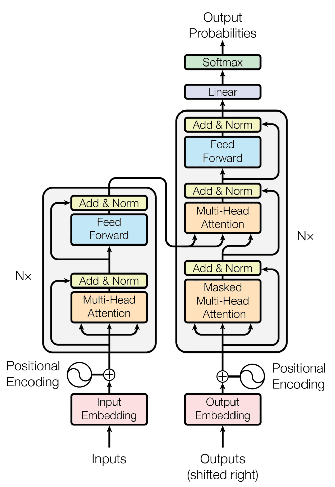
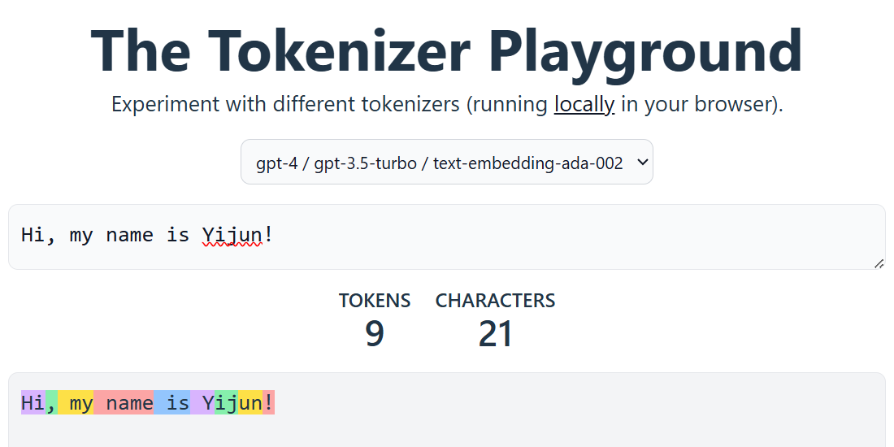

# Inside LLM

Modern LLMs rely on the **Decoder-only Transformer** architecture (derived from "Attention Is All You Need") to generate text.



At its core, this is an **autoregressive** process: given a prompt of $T$ tokens, the model predicts the $(T+1)$-th token, appends it to the prompt, and repeats.

---

## Next-Token Prediction

This inference pipeline executes via five distinct stages of tensor transformations:

**Raw Text ➔ Token IDs ➔ Combined Input Embeddings ➔ Contextualized Embeddings ➔ Next Token ID ➔ Text**

### 1. Tokenizer

**(Raw Text ➔ Token IDs)**

The **tokenizer** cuts raw text into smaller pieces called subwords (or tokens) using a built-in dictionary. It then turns each piece into a unique number (Token ID). This bridges the gap between human language and the numbers that computers understand.

You can test how this works on the https://huggingface.co/spaces/Xenova/the-tokenizer-playground



### 2. Embedding Layer

**(Token IDs ➔ Combined Input Embeddings)**

Since AI models cannot do math on plain numbers like IDs, the embedding layer translates each Token ID into a long list of numbers called a **Token Embedding** (which represents the word's meaning). 

Next, because word order matters, the model incorporates **Position Embeddings** to these lists, so it knows which word comes first, second, or third.

### 3. Transformer Blocks

**(Combined Input Embeddings ➔ Contextualized Embeddings)**

These embeddings then pass through a stack of many **Transformer blocks** (the "brain" of the model). 

Inside each block, a **Self-Attention module** lets words look at each other to understand context (like figuring out if "bank" means a riverbank or a financial bank), while hiding future words, so it cannot "cheat." 

Finally, a **Feed-Forward Network (FFN)** further cleans up and refines these word representations into rich, smart vectors.

### 4. LM Head & Softmax

**(Last Contextualized Embedding ➔ Next Token ID)**

To guess the next word, the model takes the very last word vector in the sentence, which now holds the meaning of the entire prompt. A layer called the **LM Head** scores every word in the dictionary to see which one fits best. 

The **Softmax** step turns these scores into percentages (probabilities), and the model uses "sampling" settings to pick the winning next Token ID.

### 5. Detokenization & Autoregressive Loop

**(Next Token ID ➔ Text )**

In the last step, the **tokenizer** works in reverse (Detokenization) to turn the winning Token ID back into human-readable text on your screen. The model then appends this new word to the end of the prompt and starts the whole process over again. 

This autoregressive loop runs over and over, generating text word-by-word until the model outputs a stop signal (`<EOS>`) or hits a limit.

---

## Model Training 

Now that we see how an LLM handles data during inference, how do these giant models actually learn?

Even with billions of parameters, big models learn using the exact same steps as basic machine learning: **Forward Pass**, **Loss Computation**, **Backpropagation**, and **Parameter Update**.

To show how this works, let's train a simple linear model ($\hat{y} = w \cdot x + b$) in Python using **Mean Squared Error (MSE)** and **Gradient Descent**.

### Prepare the Dataset

We generate a simple dataset based on the ground-truth function $y = 2x + 5$:

```python
import numpy as np

# Input features (x) and ground-truth targets (y)
x = np.array([1, 2, 3, 4, 5])
y = 2 * x + 5
```

### Initialize Parameters

Set a random seed for reproducibility, then randomly initialize the **Weight** ($w$) and **Bias** ($b$):

```python
np.random.seed(0)

w = np.random.random()
b = np.random.random()
```

### Compute Gradients via Chain Rule

We choose **Mean Squared Error (MSE)** as our loss function:

$$J(w,b) = \frac{1}{n}\sum\limits_{i=1}^n (\hat{y}_i - y_i)^2$$

Using the Chain Rule, we derive the partial derivatives of the loss with respect to $w$ and $b$:

Gradient for $w$: 

$$\frac{\partial J}{\partial w} = \frac{2}{n} \sum_{i=1}^{n} (\hat{y}_i - y_i) \cdot x_i$$

Gradient for $b$: 

$$\frac{\partial J}{\partial b} = \frac{2}{n} \sum_{i=1}^{n} (\hat{y}_i - y_i)$$

Using NumPy, we can compute these gradients efficiently:

```python

# Forward Propagation (Prediction)
y_hat = w * x + b

# Compute Residual Error
error = y_hat - y

# Backpropagation (Gradient Computation)
dw = 2 * np.mean(error * x)
db = 2 * np.mean(error)
```

### Parameter Update Rule

Using the **Gradient Descent** update rule: 
$\theta_{\text{new}} = \theta_{\text{old}} - \eta \cdot \nabla J(\theta)$, 

We update $w$ and $b$ using a learning rate ($\eta = 0.01$):

```python
lr = 0.01

# Update weight and bias
w = w - dw * lr
b = b - db * lr
```

### Full Training Loop

Putting everything together into an iterative training loop over 2,000 **epochs**:

```python

epochs = 2000

for epoch in range(epochs):
    error = w * x + b - y
    dw = 2 * np.mean(error * x)
    db = 2 * np.mean(error)
    w = w - dw * lr
    b = b - db * lr
    if epoch % 200 == 0:
        print(f'Epoch [{epoch:4d}/{epochs}] | w: {w:.4f} | b: {b:.4f}')
        
print("-" * 45)
print(f'Trained Model: Y = {w:.1f} * X + {b:.1f}')
```

### Output

Executing the code yields the following output:

```shell
Epoch [   0/2000] | w: 1.1252 | b: 0.8880
Epoch [ 200/2000] | w: 2.5057 | b: 3.1744
Epoch [ 400/2000] | w: 2.2569 | b: 4.0726
Epoch [ 600/2000] | w: 2.1305 | b: 4.5289
Epoch [ 800/2000] | w: 2.0663 | b: 4.7607
Epoch [1000/2000] | w: 2.0337 | b: 4.8784
Epoch [1200/2000] | w: 2.0171 | b: 4.9383
Epoch [1400/2000] | w: 2.0087 | b: 4.9686
Epoch [1600/2000] | w: 2.0044 | b: 4.9841
Epoch [1800/2000] | w: 2.0022 | b: 4.9919
---------------------------------------------
Trained Model: Y = 2.0 * X + 5.0
```

As the loss decreases across iterations, $w$ and $b$ successfully **converge** toward their target parameters ($w = 2$, $b = 5$).