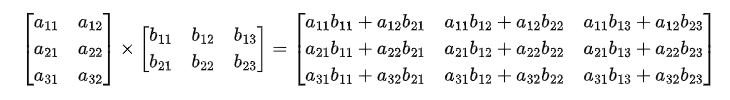

# GPU Architecture

A GPU processes massive parallel workloads through a structured hardware hierarchy: a single GPU chip comprises multiple **Streaming Multiprocessors (SMs)**, with each SM containing execution units such as **CUDA Cores** for general-purpose operations and **Tensor Cores** for deep learning and matrix math acceleration.

## The Core Building Block: Streaming Multiprocessor (SM)

The **SM** is the fundamental computing and control unit of a modern GPU. A single GPU chip contains dozens to over a hundred SMs depending on the architecture.

Each SM operates as an autonomous processing unit with three key components:

- **Control Units (Warp Schedulers & Dispatchers)**: Fetch instructions and dispatch execution tasks to threads grouped into warps (typically 32 threads).

- **On-Chip Memory**: Ultra-low-latency Register Files, Shared Memory, and L1 Data Caches to keep active data close to execution units.

- **Execution Units**: The underlying physical calculation cores (ALUs, FPUs, Tensor Cores).

## Execution Engines Inside the SM

Each SM houses two primary types of calculation engines:

### 1. CUDA Cores (FMA Units)

Execute thread-level scalar operations, primarily single-element **Fused Multiply-Add** ($d = a \times b + c$). They handle general-purpose compute, element-wise math (e.g., ReLU), vector operations, graphics shading, and pointer arithmetic.

### 2. Tensor Cores

Execute hardware-accelerated matrix multiply-accumulate operations ($D = A \times B + C$, such as $16 \times 16$ tile math) concurrently across a cooperative warp. They deliver high computational density with minimal instruction overhead, accelerating deep learning workloads and large-scale **GEMM (General Matrix Multiply)** operations.

## Matrix Multiplication in Practice

GPUs are inherently optimized for dense matrix operations.

Consider computing $C = A \times B$, multiplying a $(3 \times 2)$ matrix by a $(2 \times 3)$ matrix to produce a $(3 \times 3)$ output matrix:



To calculate the output matrix, the GPU must compute **9 output elements** ($c_{11}$ through $c_{33}$), where each element requires a 2-term dot product ($a_{i1}b_{1j} + a_{i2}b_{2j}$).


### Execution via CUDA Cores (Scalar / Element-Wise)
* **Thread Mapping:** The GPU dispatches **9 independent threads**—one thread dedicated to each output element $c_{ij}$.
* **Execution:** Each CUDA Core runs a thread and executes scalar FMA (Fused Multiply-Add) operations step by step across clock cycles (first multiplying $a_{i1} \times b_{1j}$, then accumulating $+ a_{i2} \times b_{2j}$).

### Execution via Tensor Cores (Matrix-Level / Warp-Wise)
* **Thread Mapping:** The entire matrix operation is loaded and processed collectively by a group of threads (a warp) directly into a **Tensor Core**.
* **Execution:** The Tensor Core uses its internal **Multiply-Accumulate (MAC)** hardware grid to compute the complete matrix product in parallel with a single fused matrix instruction, drastically reducing clock cycles and memory overhead.

---

# Matrix Operations

In LLMs, matrix operations process and transform data at scale. Each operation serves a specific purpose:
- **GEMM**: Combines raw inputs into new high-level features.
- **Element-wise & Normalization**: Applies independent element updates and scales vectors to stabilize numerical flow.
- **Transpose & Reshape**: Adjusts matrix dimensions to align with mathematical rules.

We will use a unified example of 2 houses (House_A and House_B), each with 3 basic features:
- Area (unit: 10m²)
- Age (unit: decades)
- Decoration Quality (score from 1 to 10)

```python
import numpy as np

# Base Input Matrix X (Shape: 2 houses x 3 basic features)
X = np.array([
    [10.0, 0.5, 9.0],  # House A: 100m², 5 years old, score 9/10
    [5.0,  2.0, 2.0]   # House B: 50m², 20 years old, score 2/10
])
```

## 1. GEMM (General Matrix Multiply)

**Intent**: Combine raw features into abstract, high-level features.

$$\text{Output Matrix } Y = \text{Input Matrix } X \times \text{Weight Matrix } W$$


We combine the 3 basic features into **2 new high-level indicators**:
- **Comfort Score**: Prefers large area, penalizes old age, prefers luxury decoration.
- **Low-Maintenance Score**: Penalizes old age, slightly penalizes large size, prefers high quality.

We store these weights in Matrix W (Shape: 3 * 2):

```python
# Weight Matrix W: 3 basic features -> 2 high-level indicators
W = np.array([
    [ 1.0, -0.1],  # Area weights
    [-2.0, -2.0],  # Age weights
    [ 1.0,  1.0]   # Decoration weights
])

# Perform GEMM: Y = X @ W (Shape: 2x3 @ 3x2 -> 2x2)
Y = X @ W

print("GEMM Output Y (Shape: 2x2):")
print(Y)

# Output:
# [[ 18.    7. ]   # House A: Comfort = 18.0, Low-Maintenance = 7.0
#  [  3.   -2.5]]  # House B: Comfort = 3.0,  Low-Maintenance = -2.5
```

## 2. Element-wise Operations & Normalization

**Intent**: Apply calculations element-by-element, or scale vectors to prevent numerical explosion.

### Element-wise Operations
Operations applied to each element independently, such as Activation Functions (e.g., GELU, SwiGLU) or Residual Additions ($X + Y$).

### Normalization (L2 Norm)

Combines row-wise aggregation (calculating length) with element-wise scaling. It rescales each vector to a unit length of 1.0 so large raw values do not dominate.

$$\hat{X} = \frac{X}{\Vert{}X\Vert{}_2}$$

```python
# 1. Calculate vector lengths (L2 Norm) for each row
norms = np.linalg.norm(X, axis=1, keepdims=True)

# 2. Normalize Matrix X so each row has length 1.0
X_norm = X / norms

print("Normalized Matrix X_norm (Shape: 2x3):")
print(X_norm)

# Output:
# [[0.742, 0.037, 0.668],  # House A (Unit Length)
#  [0.873, 0.349, 0.349]]  # House B (Unit Length)
```

## 3. Transpose & Reshape

**Intent**: Adjust matrix shapes and dimensions for mathematical alignment.

### Transpose ($X^T$) for Similarity Comparison

Transpose flips a matrix over its main diagonal, swapping rows and columns:
- $X_{norm}$ (Shape: $2 \times 3$): Rows are Houses, Columns are Features.
- $X_{norm}^T$ (Shape: $3 \times 2$): Rows are Features, Columns are Houses.

Multiplying the normalized matrix by its transpose ($X_{norm} \times X_{norm}^T$) calculates the Cosine Similarity between houses:

```python
# 1. Transpose: Swap axes (2x3 -> 3x2)
X_norm_T = X_norm.T  # Equivalent to np.transpose(X_norm)

# 2. Compute Cosine Similarity Matrix: (2x3) @ (3x2) -> (2x2)
Similarity = X_norm @ X_norm_T

print("Cosine Similarity Matrix (Shape: 2x2):")
print(Similarity)

# Output:
# [[1.         0.894]
#  [0.894      1.   ]]
```

- **Self-Similarity (1.0)**: Every house is 100% similar to itself.
- **House A vs. House B (0.894)**: The direction-based similarity between House A and House B is 89.4%.

### Reshape

Reshape alters bounding dimensions without changing the values or memory order. For instance, flattening X into a 1D sequence array:

```python
# Reshape (2, 3) into a 1D vector (6,)
X_flat = X.reshape(6)

print("Reshaped Flat Vector:")
print(X_flat)
# Output: [10.   0.5  9.   5.   2.   2. ]
```
