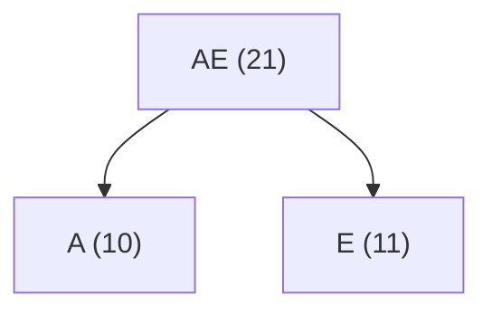
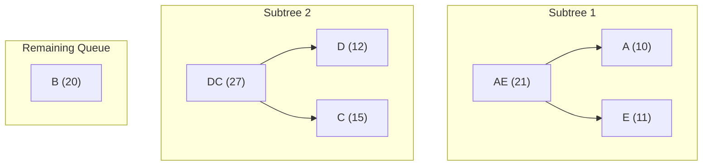
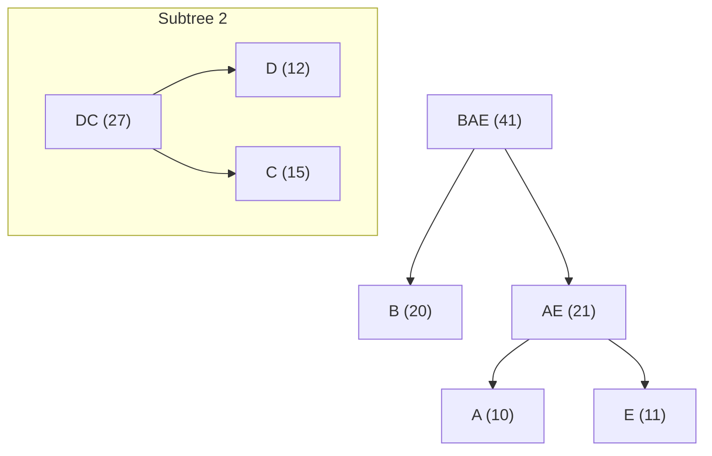
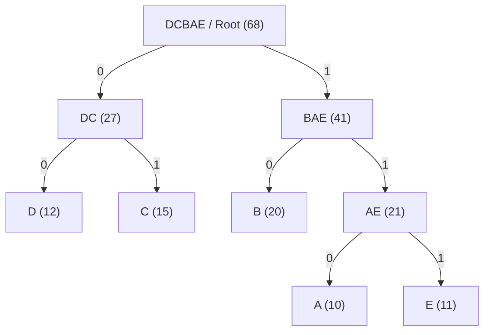

# The Greedy Strategy

A **greedy algorithm** is a simple and intuitive strategy used in computer science to solve optimization problems. The core rule is simple: **at each step, make the choice that looks best at that exact moment.**

It does not look at the bigger picture or worry about future consequences. It assumes that a series of locally optimal (best at the moment) choices will lead to a globally optimal (best overall) solution.

### Core characteristics

- **Local Optimization**: Makes the best choice right now without looking back.
- **Irreversible**: Once a choice is made, it cannot be undone or backtracked.
- **Efficiency**: Usually runs much faster than exhaustive search methods like dynamic programming.

While **greedy algorithms** do not always guarantee the best final result for every problem, they produce optimal results for specific problems, such as **Huffman Coding** and **Byte Pair Encoding (BPE)**.

## Huffman Coding

**Huffman Coding** is a lossless data compression algorithm. It works by **assigning shorter binary codes to more frequent characters and longer binary codes to less frequent characters**.

### How the greedy strategy works

- **Count Frequencies**: Count how many times each character appears in the text.
- **Build a Priority Queue**: Put each character into a min-priority queue based on its frequency.
- **Greedy Merging**:
  1. Pick the two nodes with the lowest frequencies.
  2. Merge them into a new combined node with a frequency equal to their sum.
  3. Put the new node back into the queue.
- **Repeat**: Repeat Step 3 greedily until only one node remains—the root of the Huffman Tree.

Because the algorithm greedily combines the lowest frequency items first, frequent characters end up near the top of the tree, resulting in shorter binary representations and maximum compression.

### Example

Suppose we have a short text with 5 characters and their corresponding frequencies. We first place them into a min-priority queue sorted by frequency.

- **Initial Queue**: `[ A:10, E:11, D:12, C:15, B:20 ]`

#### Round 1

Select the two nodes with the lowest frequencies: `A:10` and `E:11`.  

Combine them into a parent node `AE` with weight $10 + 11 = 21$.

- **Queue**: `[ D:12, C:15, B:20, AE:21 ]`

#### Round 2

Select the two smallest remaining nodes: `D:12` and `C:15`.

Combine them into a parent node `DC` with weight $12 + 15 = 27$.

- **Queue**: `[ B:20, AE:21, DC:27 ]`

#### Round 3

Select the two smallest remaining nodes: `B:20` and `AE:21`.

Combine them into a parent node `BAE` with weight $20 + 21 = 41$.

- **Queue**: `[ DC:27, BAE:41 ]`

#### Round 4 (Final Huffman Tree)

Select the last two remaining nodes: `DC:27` and `BAE:41`.

Combine them into the final root node `DCBAE` (Root) with weight $27 + 41 = 68$.

- **Queue**: `[ DCBAE:68 ]`

## Byte Pair Encoding (BPE for Tokenization)

**Byte Pair Encoding (BPE)** was originally a lossless data compression algorithm. Today, it is the standard tokenization method for LLMs, breaking raw text into **smaller chunks** called **tokens**.

While traditional algorithms like **Huffman coding** shrink file size by shortening the bits of each character, **BPE** shrinks text by merging frequent character sequences into single tokens. This reduces the total length of the sequence, making it ideal for LLMs.

### How the greedy strategy works

BPE builds its vocabulary using a bottom-up, greedy approach:

- **Start with Base Units**: Break all training text into individual characters (or UTF-8 bytes) to form the starting vocabulary.

- **Count Pairs**: Scan the text and count how often every adjacent pair of symbols appears together.

- **Greedy Merge**: Pick the single most frequent adjacent pair and merge it into a new, combined token.

- **Repeat**: Add the new token to the vocabulary, update the text, and repeat the counting and merging process until reaching the target vocabulary size.

### Example

Suppose the training corpus contains: `hug`, `pug`, `hugs`, and `hugging`.
- Corpus: `h u g, p u g, h u g s, h u g g i n g`
- Vocabulary: `[g, h, i, n, p, s, u]` (base characters)

#### Round 1

The pair `(u, g)` is the most frequent adjacent pair across all words, merge `(u, g)` to `ug`.
- Corpus: `h ug, p ug, h ug s, h ug g i n g`
- Vocabulary: `[g, h, i, n, p, s, u, ug]`

#### Round 2 (Final)

Next, `(h, ug)` becomes the most frequent pair, merge `(h, ug)` to `hug`.
- Corpus: `hug, p ug, hug s, hug g i n g`
- Vocabulary: `[g, h, i, n, p, s, u, ug, hug]`

By greedily merging the most frequent pair at each step, BPE gradually builds an efficient vocabulary that balances single characters and full words.

---

# Tokenizer

A **Tokenizer** is the translation pipeline between human language and neural networks. Because machine learning models only process numbers, a **tokenizer** converts raw text into numerical sequences (Token IDs) during encoding, and decodes those IDs back into readable text during generation.

## Categories

Depending on how text is split, tokenization algorithms fall into three main granularities:

### 1. Word-Level

- **High Semantic Density**: Aligns directly with natural words, resulting in short sequence lengths.
- **Huge Vocabulary Size**: Requires dictionaries with hundreds of thousands of words.
- **Severe OOV Risk**: Cannot handle unseen words, causing frequent Out-of-Vocabulary (`<UNK>`) errors.

### 2. Subword-Level (e.g., BPE, BBPE)

- **Optimal Balance**: Keeps vocabulary size manageable while preserving strong semantic context.
- **Zero/Low OOV**: Gracefully handles rare or unseen words by breaking them into subword roots.
- **Complex Pipeline**: Requires statistical training on massive corpora, pre-tokenization rules, and heavy runtime overhead.

### 3. Char-Level

- **Tiny Vocabulary**: Requires only a few hundred tokens (ASCII or Unicode characters).
- **Zero OOV Risk**: Can represent any raw text input without unknown tokens.
- **Zero Training Overhead**: No statistical pre-training or corpus training required.
- **Long Sequences**: Increases input sequence lengths by 3–5x, raising GPU attention costs.
- **Weak Token Semantics**: Individual characters carry little semantic meaning on their own.

## Char-Level Tokenizer

When working with small datasets, lightweight models, domain-specific projects, or educational systems, training a statistical subword tokenizer is impractical due to insufficient corpus diversity.

A **Char-Level Tokenizer** provides a zero-overhead, predictable pipeline. Below are the engineering design choices:

### 1. In-Memory Dual $O(1)$ Lookup Tables

To optimize processing speed, the tokenizer maintains two separate lookup tables in memory:

- `token_to_id` (dict): Maps characters to integer IDs for $O(1)$ encoding.
- `id_to_token` (dict): Maps integer IDs back to characters for $O(1)$ decoding.

Converting an ID back to a character without `id_to_token` requires a linear array scan ($O(N)$ time complexity). Maintaining dual lookup tables trades a negligible amount of memory for constant-time ($O(1)$) speed during both encoding and decoding.

### 2. Single Source of Truth Persistence

To eliminate data redundancy, `tokenizer.json` stores only the vocab array along with special token declarations (`<EOS>` and `<UNK>`).

The raw vocab array serves as the **single source of truth**. Upon `_load()`, the system uses `enumerate()` to dynamically rebuild both $O(1)$ memory lookup tables in microseconds, keeping disk storage clean and lightweight.

### 3. Singleton Pattern State Management

The `CharTokenizer` class enforces the **Singleton pattern** via `__new__`. This guarantees that all application modules share a single, synchronized `CharTokenizer` instance in memory, preventing state desynchronization and redundant disk I/O operations.

### Public API Reference

The `CharTokenizer` class exposes a minimal set of methods for vocabulary management and text processing:

- `add_corpus(text: str) -> None`: Extracts unique characters from the input string, appends new tokens to the vocabulary, and automatically triggers `_save()` to update `tokenizer.json`.
- `encode(text: str, add_eos: bool = True) -> list[int]`: Converts text into a list of integer Token IDs ($O(1)$ per character). Unknown characters fall back to `unk_id`, and `eos_id` is appended if `add_eos` is `True`.
- `decode(ids: list[int]) -> str`: Converts a sequence of Token IDs back into raw text ($O(1)$ per ID). Decoding automatically terminates if `eos_id` is encountered.
- `reset_all() -> None` (Class Method): Deletes the persisted `tokenizer.json` file from disk and resets the in-memory Singleton instance. Useful for testing environments and pipeline resets.